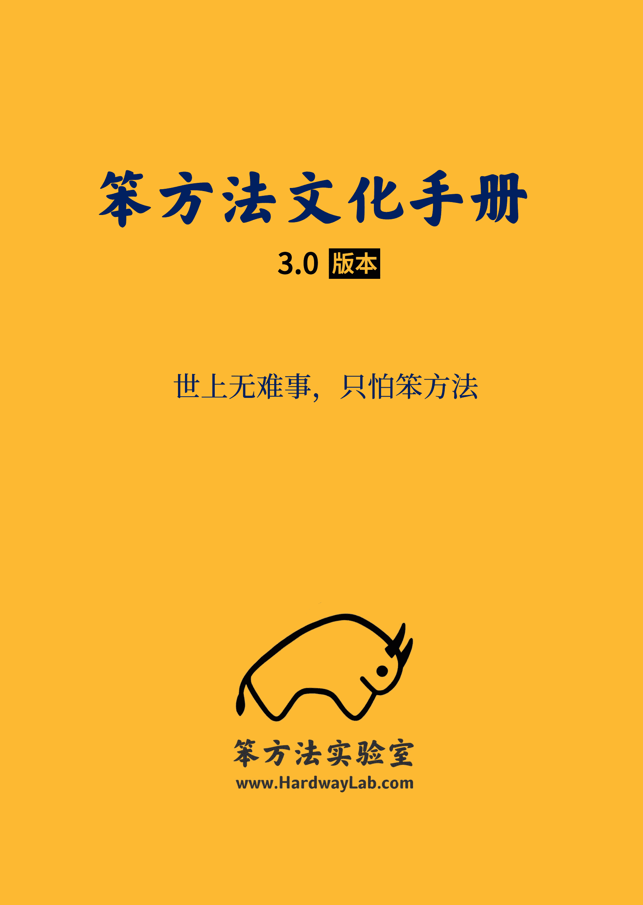
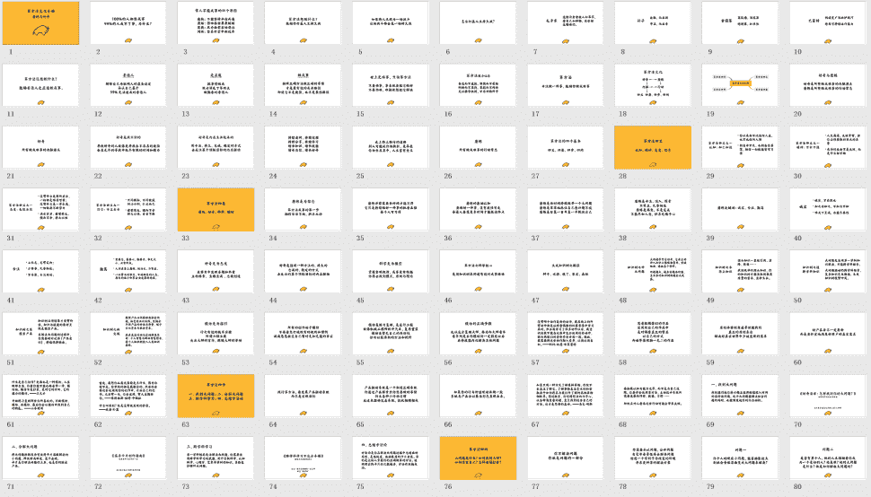

# 《笨方法文化手册 3.0》下载地址

> 来源：[`www.yuque.com/hardwaylab/book/miyg7a`](https://www.yuque.com/hardwaylab/book/miyg7a)

<ne-oli><ne-oli-i>1</ne-oli-i><ne-oli-c class="ne-oli-content" id="u47b5f0c2" data-lake-id="u47b5f0c2"><ne-text id="uab20a667" ne-bold="true">Github 下载</ne-text><ne-text id="uc155323e">：</ne-text>[<ne-text id="uc60ec18f">点击此处</ne-text>](https://github.com/cnfeat/hardwaylab)</ne-oli-c></ne-oli> <ne-oli><ne-oli-i>2</ne-oli-i><ne-oli-c class="ne-oli-content" id="u0f5898d9" data-lake-id="u0f5898d9"><ne-text id="u9c61a53a" ne-bold="true">微信下载：</ne-text><ne-text id="ubc074ccd">扫描添加微信，发送「文化手册」</ne-text></ne-oli-c></ne-oli> <ne-p id="u027e487f" data-lake-id="u027e487f"><ne-text id="ue1718c9d">添加微信，再附赠 100 页《笨方法文化幻灯：好奇与磨练》</ne-text></ne-p> <ne-p id="u9a31a75a" data-lake-id="u9a31a75a"><ne-card data-card-name="image" data-card-type="inline" id="u2f0aa425" data-event-boundary="card" class="ne-spacing-all"><ne-card data-card-name="image" data-card-type="inline" id="u153cd7a8" data-event-boundary="card" class="ne-spacing-all">  <ne-p id="uc4147bbc" data-lake-id="uc4147bbc"><ne-card data-card-name="image" data-card-type="inline" id="u55558eae" data-event-boundary="card" class="ne-spacing-all">  <ne-p id="uf40bc8b4" data-lake-id="uf40bc8b4"><ne-text id="ufa3bd843">gayhub 链接，404 Not Found 了，大佬</ne-text></ne-p> <ne-p id="u8a16e6e7" data-lake-id="u8a16e6e7"><ne-text id="u3466aa36">已更新。</ne-text></ne-p> <ne-p id="u9811264b" data-lake-id="u9811264b"><ne-text id="ubb0a99e1">感谢！</ne-text></ne-p> <ne-p id="uc249e98b" data-lake-id="uc249e98b"><ne-text id="u9915e790">github 404 了</ne-text></ne-p> <ne-p id="u8a16e6e7" data-lake-id="u8a16e6e7"><ne-text id="u3466aa36">已更新。</ne-text></ne-p></ne-card></ne-p></ne-card></ne-card></ne-p>