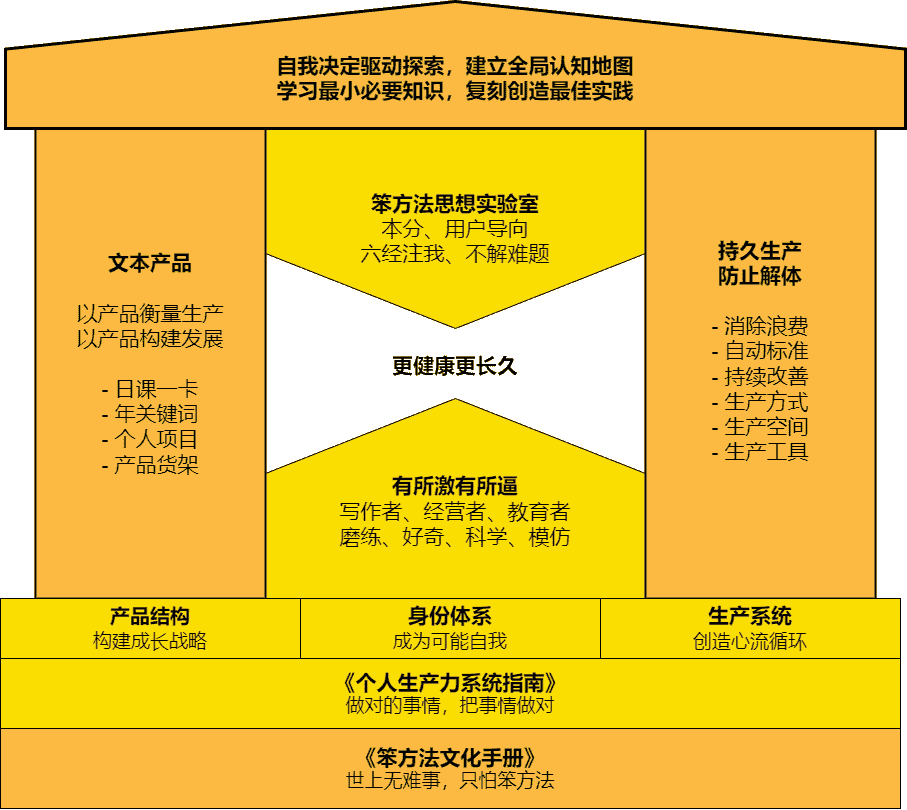

# 什么是笨方法实验室？

> 来源：[`www.yuque.com/hardwaylab/book/rxvcit`](https://www.yuque.com/hardwaylab/book/rxvcit)

> 我们相信，无论成长到哪个阶段，强大的共同价值观都可以让我们维持一贯的组织文化及凝聚力。 
> 
> 我们坚信，好文化会有高概率会带来好结果。 

太多人喜欢做计划，太少人去做实验；太多人喜欢找寻真实的自我，太少人去探索可能的自我。 

人生更像一个实验，笨方法实验室试图建立一个假设，不断用一次又一次的实验探索人生的改变。在一次一次的改变中实现可能的自我。 

这本手册，就是笨方法实验室生产出的稳定、可用的基本方法论——提供一份无限清单，鼓励你去做正确的事，做困难的事，在实验室解决难题，在现实世界不解难题。 

## 笨方法实验室文化

 

笨方法实验室相信「世上无难事，只怕笨方法」，主张「99% 的努力都是白费」，为 1% 的实现可能而做长期努力，成为可能自我。 

笨方法实验室试图成为你的成长熔炉。你在此寻找并解决大问题，用解题思维解决难题，接受学习、实践、探索和生产的压力测试，进而回到现实世界，用创造思维，实现「[不解难题](https://www.yuque.com/hardwaylab/book/zi4qlb)」。 

  

### 经营使命

> 

我们为何存在？ 

——世上无难事，只怕笨方法 

### 核心价值观

> 我们相信什么？ 
> 
> 怎么分清哪些事情是对的，哪些事情是不对的？ 

——[本分](https://www.yuque.com/hardwaylab/book/nhue62) 

### 经营理念

> 我们将怎样做？ 

——用户导向、[六经注我](https://www.yuque.com/hardwaylab/book/vsxvdy)、[不解难题](https://www.yuque.com/hardwaylab/book/zi4qlb) 

### 愿景

> 我们想成为什么？想去哪里？ 

——成为[更健康、更长久](https://www.yuque.com/hardwaylab/book/pv8x5g)的进步共同体 

### 笨方法精神

> 在创造某产品，提供某服务之前，连问 5 次「这为什么重要」。 

——磨练、好奇、科学、模仿 

+   磨练：是为故事，自我决定驱动探索 

+   好奇：是为信念，建立全局认知地图 

+   科学：是为模型，学习最小必要知识 

+   模仿：是为行动，复刻创造最佳实践 

## one more thing

 

我爱看梁文道的《一千零一夜》。某一期「出走季」中，梁文道与邻桌大叔对话： > 大叔说：「现在的年轻人得有点信仰有点韵味。」 
> 
> 梁文道说：「对，还是希望能做到这样。」 

若你觉得独坐是困倦乏味，想用费点心机做出惊喜，不如唱这歌，美好前程跟我再追寻—— 

> 成和败努力尝试 人若有志应该不怕迟 
> 
> 谁人在我未为意 成就靠真本事 
> 
> 做个真的汉子 承担起苦痛跟失意 
> 
> 投入要我愿意 全力干要干的事∎