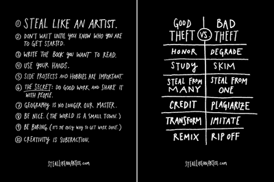

# 四、\. 模仿：怎样开展你的笨方法行动？

> 来源：[`www.yuque.com/hardwaylab/book/gatkt8`](https://www.yuque.com/hardwaylab/book/gatkt8)

> 关键词：成长型思维、行动、创造、技术、开放、解答 

模仿是为行动，探索成功可能，降低行动成本，思考普通人如何变得更有创造力的技术。 

作家王文兴说： > 什么是自己创作？无非也是一种模仿。人家做那么高，你看你能不能也跟着学一学，模仿他。模仿不是抄袭，是对它的方向、它的能力的模仿。 

例如这本笨方法手册，也是我模仿写出来的，不断找市面能找到的最好的手册——《谷歌方法》、《奈飞文化手册》、《得到品控手册》等，反复看，反复做，反复改，反复发布，反复更新，参考不断更新而成的。 

虽然可能只是笨拙的模仿，虽然有可能会被人诟病，但我不太关心，我关心的是：我是否输出了某个产品，我是否超越了日常水平，我是否能让你能从中得到收获。 

  

所谓的「模仿」，是要带着开放的心态借鉴、欣赏，不要盯着一个人、一个机构、一个物件、一个产品去「模仿」，而是要学会从多个源头获取灵感，并进行混合、变形、再创作，并非单纯的抄袭。 

[《离线·副本时代》](https://the-offline.com/2021/07/22/abc-03/)： > 仿制品在对正本进行微妙地修饰的过程中，会创造出意义。 

大多数人都相信，创意是来自于对一个特定问题的课题做长时间准备，并且恒定做出新尝试，直到做出独创的解决方案为止，而模仿就无需如此，你只需一个简单的理由，你想做就开始做，独创并非最重要，开始做才是最重要的。∎