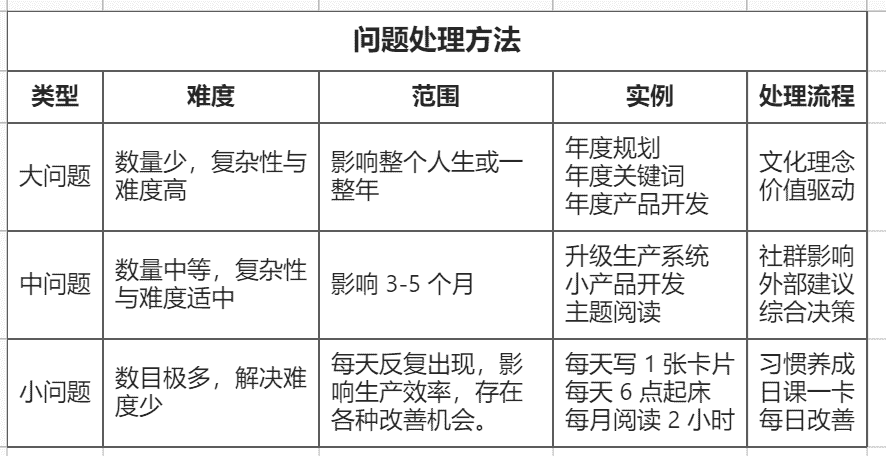

# 四问：怎样走上笨方法道路？

> 来源：[`www.yuque.com/hardwaylab/book/dvlfog`](https://www.yuque.com/hardwaylab/book/dvlfog)

> 不是因为我太聪明，而是因为我在问题上停留的时间更长。——阿尔伯特 · 爱因斯坦 

段永平：不存在什么捷径。不存在什么窍门。如果你想走轻松的路，我保证：它比艰难的路更长更痛苦。 

Alaska 有句话，shortcut is the fastest way to get lost（捷径是迷路的最快的办法。）不存在什么弯道超车的事情，关注本质最重要！不然即使超过去，也会被超回来。（2018-09-30） 

如果你不承认自己有问题，你不会改变，如果你不相信你有问题，你也不会改变。 

面对一个可能影响到我们所有人的事件时，倘若还没有人发现问题和指出问题，那我们就应该站出来，发现和指出问题所在。而当所有人都已经瞄准了这个问题，甚至已经形成情绪时，我们或许不应任由情绪继续泛滥，而是更应该思考和引导大家思考：到底如何才能更好解决问题？ 

毕竟，如果你不解决问题，那么你就是问题的一部分。 

你必须建立一个元问题库，里面都是你最喜欢的问题，当你透过你最喜欢的问题的镜头看世界时，大脑会暗自运行组织思维，在生活中找到线索。这种新的意识将帮助你建立信心和信任，保持你对人生的好奇探求。 

你需要承认问题，并公开问题，寻找信息与帮助，自觉带着责任感去解决问题，创造一个有利于你改变的环境，寻求更科学的解决方案。 

+   1）确定大问题； 

+   2）找到大问题的各种成因； 

+   3）确定大问题的解决后理想结果； 

+   4）根据以上因果关系，拆分出各种小问题； 

+   5）反复审查问题因果，查漏补缺，完善问题分支。 

拆解完大问题后，你会发现，各种小问题根本无法用单一维度，单一学科知识解决，只能才多维度，多学科解决。 

拆解大问题时要注意，没有人一开始就能拆解出好的小问题，一旦发现一个小问题再无法指导你的努力方向，就要及时放弃和替换。当某个小问题比另外一个更有效率、更有趣，或者比你原先的计划更合理时，你不妨做出改变。各个小问题要注意层次越统一、一致协调，这样就有助于解答大问题。 

好问题比答案重要，以下 4 个笨方法元问题，值得持续一生去追寻。 <ne-oli><ne-oli-i>1</ne-oli-i><ne-oli-c class="ne-oli-content" id="f7de0d8fb9dbd0e675de94be7b2d7e1e" data-lake-id="f7de0d8fb9dbd0e675de94be7b2d7e1e">你的个人现实小问题，能否抽象放大到社会责任层面，变成一个大问题，你将推动解决这个问题？</ne-oli-c></ne-oli> <ne-oli><ne-oli-i>2</ne-oli-i><ne-oli-c class="ne-oli-content" id="7a05f66d41c8ed74948715b39ffe1012" data-lake-id="7a05f66d41c8ed74948715b39ffe1012">是否有某个人，他的人生激励着你成为一个更好的人？他是谁？他的大问题是什么？他是如何解决大问题的？</ne-oli-c></ne-oli> <ne-oli><ne-oli-i>3</ne-oli-i><ne-oli-c class="ne-oli-content" id="4e530aee7ba3854d1b5ff71008f6a4b5" data-lake-id="4e530aee7ba3854d1b5ff71008f6a4b5">如何怎样采取微小但有意义的方式，可以不假思索地、惯性地持续行动实践，并改变当前的工作态度或生活方式？</ne-oli-c></ne-oli> <ne-oli><ne-oli-i>4</ne-oli-i><ne-oli-c class="ne-oli-content" id="94a5dbb1fea79f67c2d4b52593191f2e" data-lake-id="94a5dbb1fea79f67c2d4b52593191f2e">如何将你探寻、分解、解决大问题的过程孵化成为个人项目，并将项目成果封装成为能为解决社会问题的产品或服务？</ne-oli-c></ne-oli> 

  <ne-hole id="u953b25d2" data-lake-id="u953b25d2"><ne-p id="u8535be57" data-lake-id="u8535be57">分享一个持续自我提问的小技巧： 

注册一个 [flomo](https://flomoapp.com/register2/?NDA0MA) 账号，建立一个「面试题库」的标签，每条 flomo 就是一个问题，使用[「每日回顾」](https://help.flomoapp.com/advance/lucky.html)功能，每天早上 10 点和晚上 10 点定时给自己发送问题。 

「面试题库」的问题清单见 [笨方法实验室会员计划](https://www.yuque.com/hardwaylab/book/bq5a1v)。</ne-hole></ne-p>