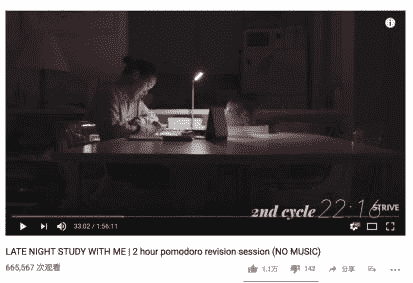
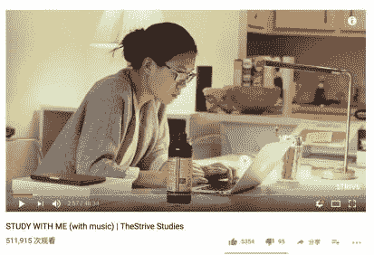

# 榜样：怎样向凿壁偷光者学习？

> 来源：[`www.yuque.com/hardwaylab/book/gnn41i`](https://www.yuque.com/hardwaylab/book/gnn41i)

> 决定我们命运的并不是你做出了多少正确决策，而是你对什么东西的热爱和努力。当然还有运气。 

很多人追求创作的灵感。 

但「[灵感并不实用](http://haohailong.net/2019/03/muse-and-the-so-called-real-stuff/)。灵感本身并不能告诉你完成一件事情的流程，更不能帮你自动完成一件事。」 

我更多的是追求创作的习惯，保持固定的阅读、写作、修改、发布的习惯，看似是每日行动的复制粘贴，但实际上是减少无谓的等待灵感时间耗费，固化与增大灵感产生的概率。 

如果说灵感能让你的从 A 一下子走到了 E，习惯就是 A  >  B >  C  > D > E。 

有人曾说：一个人的天赋和毅力愈加薄弱，才会愈加强调「工具」和「灵感」的重要性。 

灵感是可遇不可求，而习惯却是稳打稳扎，步步为营；灵感可以给你带来惊喜，令你上瘾，但也让你守株待兔，而习惯不管日晒雨淋，用笨方法，始终扎硬寨，打呆仗，前进一步是一步。 

灵感多不能复制，它是时间的艳遇，而习惯可以复制，它才是时间的朋友。 

艾略特说：一个人必须要有写作的习惯，为了配得上这缪斯（可激发灵感的女神）的偶然或最终的造访。因为如果一个人从不写作，而感觉到灵感来临的话，他可能配不上他的灵感。 

如何才能养成习惯？ 

人终归是人，大脑千万年养成的偷懒习性是不可能那么容易改变的，你会控制不住，我也会控制不住。 

你会一个晚上什么都不干，就会吃薯片看电影、打游戏、刷豆瓣、听音乐、看漫画、刷抖音…… 

这个时候该怎么办？ 

我现在惯常做法是，找到那正在学习创作的人，和他们一起工作学习。 

但我是个不爱社交的人，也不喜欢去人多的地方，往往选择这样做。

  

  

  

Youtube 有一个叫做 TheStrive Studies 的视频[《Study With Me》](https://www.youtube.com/channel/UCSQkQjPhnZw12Hj-SfsbX8w)。 

上面都是一个人在夜晚学习的情节，她就是静静在学习，经常一学就是两三个小时。  

每当我晚上想吃薯片看电影、打游戏、刷豆瓣、听音乐、看漫画、刷抖音的时候，我就会打开这个视频。 

我是从 [@Sophie Z](https://www.douban.com/people/sophie-z/status/) 的豆瓣广播中知道这个视频的，她这样介绍这个视频： 

YouTube 上有一个频道叫 TheStrive Studies（没记错的话是一个医学院的学生开的）。女主的 Vlog 很特别，一句话也没有，就是坐在镜头前学习几个小时，背景音乐就是那种室内沙发音乐。非常凝神静气了，用这个视频当小屏幕的背景，我写完了第三篇 essay。。  

这种有气质的人，英文叫 Striver，中文名我称之为「凿壁偷光者」。 

「凿壁偷光」当然是起源自西汉匡衡勤学苦读的故事，但启发我个人开始启用「凿壁偷光者」这个名字的，是汤川秀树的这段话： > 「感觉自己的人生列车似乎还没有一路黑到底，它正在穿过漫长的隧道，此时经过正可能是最黑暗的一段，但它依然还是那样平稳地呼呼而过，这就是它的平常。可我依然坚信，光明总会到来，我要等到那一刻。」 

我将「凿壁偷光者」定义为：有着一般人少有的可怕认真、韧性与平常心的人，他们可能孤独、可能失败、可能现在做的事情在他人看来没有意义，但他们心底依然保存着那种洁白的、坚硬的、发亮的东西。 

此后我就开始收集「凿壁偷光者」的图片：  

在豆瓣建了一个[《凿壁偷光者》的相册](https://www.douban.com/photos/album/1686159083/)：  

看着这些图片，我就会想：看看别人，看看别人，看看别人，自己呢？ 

这些文图片也许可以陪伴你无数个夜晚，但你需要知道，这些都是外在驱动。 

真正的凿壁偷光者是自内而外散发着光芒的，这种光芒不是来自外部，而是来自自己的内心的，别人不能成为你的发动机，你需要有自己的发动机，别人不能持续给你光芒，你需要成为自己的太阳，营造自己的[高光时刻](https://mp.weixin.qq.com/s?__biz=MzA4MTQ0NDQxNg==&mid=2650640034&idx=1&sn=3b3151b5046e85e54c819641df6b0894&chksm=879dc58db0ea4c9b858b05b09e0640c822d4288fe14c68b57a7e9132d9f681a0da3190e83be7&token=348230470&lang=zh_CN#rd)。 

此时，你需要在头脑中想象出一个人。 

他存在另一个平行宇宙，他会定期来看你，他每次几乎都是满怀不满地离去，因为他每次看见的都是能力不足的你——如果我每次遇见这样的对手都会很失望吧，所以他每次都说出尖酸刻薄的话： 

「你就这样懒懒散散地活下去吧，你看看 10 年以后你什么样，我什么样？」 

「如果你计划用 10 年时间取得成功，那么你应当问问自己：你为什么不能在 6 个月的时间里完成它呢？」 

就因为这样，每一次我疲惫、懈怠的时候，我就在想：那个在平行宇宙的自己现在是怎样一个状态，他在思考什么，他在做什么？ 

每当他写作阻滞、无法突破、非常寂寞，怎么办呢？ 

每当他身心疲惫、想打游戏、想看手机，该怎么办？ 

别想那么多了，直接把平行宇宙的他召唤过来就好了，是的，那个平行宇宙的他就是你的力量之源，就像毒液之于艾迪、九尾之于鸣人、寄生兽之于泉新一，这种内生心理暗示的力量可以自己变得更强。 

此时，我就会开始去到那个能令我专注的、具有仪式感的场地，定定地坐在桌子持续三四个小时写作，高光照射，就像变了一个人一样。 > 玛格丽特·米德：永远不要怀疑一小群有思想、信念坚定的人可以改变这个世界。事实上，这也是这个世界改变的唯一方式。 

如何找到那个平行宇宙的你呢？ 

从一封信开始，让在那个在平行宇宙的你给写一封信吧——这份信当然还是要你自己来写，写下他对你的反省、期待和鼓励，让这个世界的你充满信心，纵情向前。  

写完抬头一看，估计那个平行宇宙的你已在对你微笑了吧。∎ 

### 

 

很有用！现在就换壁纸。在脑海中虚构形象，也要继续呀🍺