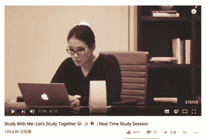

# 榜样：怎样向凿壁偷光者学习？

> 来源：[`www.yuque.com/hardwaylab/book/gnn41i`](https://www.yuque.com/hardwaylab/book/gnn41i)

<ne-quote id="u02f505b8" data-lake-id="u02f505b8"><ne-p id="d83fb42a7d7a4b8bd710ee5e80040077" data-lake-id="d83fb42a7d7a4b8bd710ee5e80040077"><ne-text id="u6bb7f880">决定我们命运的并不是你做出了多少正确决策，而是你对什么东西的热爱和努力。当然还有运气。</ne-text></ne-p></ne-quote> <ne-p id="217e577ba21a39aa6101f66e3d2bb540" data-lake-id="217e577ba21a39aa6101f66e3d2bb540"><ne-text id="u9d97b5ad">很多人追求创作的灵感。</ne-text></ne-p> <ne-p id="7e7cc5691a777846b4bc8a79770a3da6" data-lake-id="7e7cc5691a777846b4bc8a79770a3da6"><ne-text id="uf6b4649c">但「</ne-text>[<ne-text id="u234216e0">灵感并不实用</ne-text>](http://haohailong.net/2019/03/muse-and-the-so-called-real-stuff/)<ne-text id="ucef38c48">。</ne-text><ne-text id="u9d0cc7b6">灵感本身并不能告诉你完成一件事情的流程，更不能帮你自动完成一件事。</ne-text><ne-text id="u98075ef5">」</ne-text></ne-p> <ne-p id="64ac9bef3f4adb28f28abce40ab4ed58" data-lake-id="64ac9bef3f4adb28f28abce40ab4ed58"><ne-text id="ubd4880b9">我更多的是追求创作的习惯，保持固定的阅读、写作、修改、发布的习惯，看似是每日行动的复制粘贴，但实际上是减少无谓的等待灵感时间耗费，固化与增大灵感产生的概率。</ne-text></ne-p> <ne-p id="73957e4d0941a7e61fa5a7d33a772fa5" data-lake-id="73957e4d0941a7e61fa5a7d33a772fa5"><ne-text id="ua7ad475c">如果说灵感能让你的从 A 一下子走到了 E，习惯就是 A  >  B >  C  > D > E。</ne-text></ne-p> <ne-p id="3a231914ca1cf6cfc6f3dfb47b5a9c49" data-lake-id="3a231914ca1cf6cfc6f3dfb47b5a9c49"><ne-text id="ue0bacf83">有人曾说：</ne-text><ne-text id="u5f54fa83">一个人的天赋和毅力愈加薄弱，才会愈加强调「工具」和「灵感」的重要性。</ne-text></ne-p> <ne-p id="0c455c9fa9dca60f54551e13f3ca774b" data-lake-id="0c455c9fa9dca60f54551e13f3ca774b"><ne-text id="ubeb790b0">灵感是可遇不可求，而习惯却是稳打稳扎，步步为营；灵感可以给你带来惊喜，令你上瘾，但也让你守株待兔，而习惯不管日晒雨淋，用笨方法，始终扎硬寨，打呆仗，前进一步是一步。</ne-text></ne-p> <ne-p id="44354797ca31e6442ae61485777ca03e" data-lake-id="44354797ca31e6442ae61485777ca03e"><ne-text id="u574b2125">灵感多不能复制，它是时间的艳遇，而习惯可以复制，它才是时间的朋友。</ne-text></ne-p> <ne-p id="cb2b8a0155020204fbfbc116426cdcee" data-lake-id="cb2b8a0155020204fbfbc116426cdcee"><ne-text id="u7ff43360">艾略特说：一个人必须要有写作的习惯，为了配得上这缪斯（可激发灵感的女神）的偶然或最终的造访。因为如果一个人从不写作，而感觉到灵感来临的话，他可能配不上他的灵感。</ne-text></ne-p> <ne-p id="88637e0ef1d36354282ed70decdbabfb" data-lake-id="88637e0ef1d36354282ed70decdbabfb"><ne-text id="u4780a736">如何才能养成习惯？</ne-text></ne-p> <ne-p id="55a5ca88bb92f85c4edf24a74f31fb81" data-lake-id="55a5ca88bb92f85c4edf24a74f31fb81"><ne-text id="u570200dc">人终归是人，大脑千万年养成的偷懒习性是不可能那么容易改变的，你会控制不住，我也会控制不住。</ne-text></ne-p> <ne-p id="0a8c04ccd1add0f046cb7c41b490ef2c" data-lake-id="0a8c04ccd1add0f046cb7c41b490ef2c"><ne-text id="u2e33d988">你会一个晚上什么都不干，就会吃薯片看电影、打游戏、刷豆瓣、听音乐、看漫画、刷抖音……</ne-text></ne-p> <ne-p id="73413b39cd0f28aaaafed28a75a1fdb9" data-lake-id="73413b39cd0f28aaaafed28a75a1fdb9"><ne-text id="u4f5f9f4e">这个时候该怎么办？</ne-text></ne-p> <ne-p id="e4a253919ba437287f757e0977be1180" data-lake-id="e4a253919ba437287f757e0977be1180"><ne-text id="u98e0ce10">我现在惯常做法是，找到那正在学习创作的人，和他们一起工作学习。</ne-text></ne-p> <ne-p id="e2d9d39ca57485120cc63fb2e4e12471" data-lake-id="e2d9d39ca57485120cc63fb2e4e12471"><ne-text id="u763bd6a6">但我是个不爱社交的人，也不喜欢去人多的地方，往往选择这样做。</ne-text></ne-p><ne-p id="a20d224c568e48b9d67847a2c66a8c01_p_0" data-lake-id="a20d224c568e48b9d67847a2c66a8c01_p_0"><ne-card data-card-name="image" data-card-type="inline" id="M4jT2" data-event-boundary="card">  <ne-p id="2dfefc95d05b44d4940335ac0e13619e" data-lake-id="2dfefc95d05b44d4940335ac0e13619e"><ne-card data-card-name="image" data-card-type="inline" id="KPJ8t" data-event-boundary="card">  <ne-p id="ff8f48d9b7d6462fdbc4542738f1e02b" data-lake-id="ff8f48d9b7d6462fdbc4542738f1e02b"><ne-card data-card-name="image" data-card-type="inline" id="NYCpi" data-event-boundary="card">  <ne-p id="1511b64c11a201a74bc650566a98a340" data-lake-id="1511b64c11a201a74bc650566a98a340"><ne-text id="ub019c7dc">Youtube 有一个叫做 TheStrive Studies 的视频</ne-text>[<ne-text id="u01c977a4">《Study With Me》</ne-text>](https://www.youtube.com/channel/UCSQkQjPhnZw12Hj-SfsbX8w)<ne-text id="u1ded7a4b">。</ne-text></ne-p> <ne-p id="2334dfd9acdc7a7e86a4b9d839917383" data-lake-id="2334dfd9acdc7a7e86a4b9d839917383"><ne-text id="u0d20ccee">上面都是一个人在夜晚学习的情节，她就是静静在学习，经常一学就是两三个小时。</ne-text></ne-p>  <ne-p id="1617c5ff0fd81e69b29bc03ea5c01010" data-lake-id="1617c5ff0fd81e69b29bc03ea5c01010"><ne-card data-card-name="image" data-card-type="inline" id="kP1Ph" data-event-boundary="card"><ne-p id="be408d0f2692ced0707b350386efe864" data-lake-id="be408d0f2692ced0707b350386efe864"><ne-card data-card-name="image" data-card-type="inline" id="zQZse" data-event-boundary="card"><ne-p id="a2b348c03a60b11a206004cf7f6e52de" data-lake-id="a2b348c03a60b11a206004cf7f6e52de"><ne-text id="u9db59654">每当我晚上想吃薯片看电影、打游戏、刷豆瓣、听音乐、看漫画、刷抖音的时候，我就会打开这个视频。</ne-text></ne-p> <ne-p id="409abc5d9a229b4410be76cd33eb79fd" data-lake-id="409abc5d9a229b4410be76cd33eb79fd"><ne-text id="u3c751008">我是从</ne-text> [<ne-text id="ud0ad5738">@Sophie Z</ne-text>](https://www.douban.com/people/sophie-z/status/) <ne-text id="u6fcba3fd">的豆瓣广播中知道这个视频的，她这样介绍这个视频：</ne-text></ne-p> <ne-p id="2f7a91f4f120b1997b9d1a56009894c2" data-lake-id="2f7a91f4f120b1997b9d1a56009894c2"><ne-text id="u879f1a5d">YouTube 上有一个频道叫 TheStrive Studies（没记错的话是一个医学院的学生开的）。女主的 Vlog 很特别，一句话也没有，就是坐在镜头前学习几个小时，背景音乐就是那种室内沙发音乐。非常凝神静气了，用这个视频当小屏幕的背景，我写完了第三篇 essay。。</ne-text></ne-p>  <ne-p id="70ddd374bb73b89c126167bd50fc67a5" data-lake-id="70ddd374bb73b89c126167bd50fc67a5"><ne-card data-card-name="image" data-card-type="inline" id="QewF2" data-event-boundary="card"><ne-p id="35cf25cd9a9fbc772db868615de2fc03" data-lake-id="35cf25cd9a9fbc772db868615de2fc03"><ne-card data-card-name="image" data-card-type="inline" id="VdUsv" data-event-boundary="card"><ne-p id="9f9139b55eed3d0cf9f9f4c5f56510b9" data-lake-id="9f9139b55eed3d0cf9f9f4c5f56510b9"><ne-text id="u2e02e716">这种有气质的人，英文叫 Striver，中文名我称之为「凿壁偷光者」。</ne-text></ne-p> <ne-p id="ba71b3f3b9c6e216dac4a982c8ad772b" data-lake-id="ba71b3f3b9c6e216dac4a982c8ad772b"><ne-text id="u4e437528">「凿壁偷光」当然是起源自西汉匡衡勤学苦读的故事，但启发我个人开始启用「凿壁偷光者」这个名字的，是汤川秀树的这段话：</ne-text></ne-p> <ne-quote id="u4d487f46" data-lake-id="u4d487f46"><ne-p id="8cf77a329fc53aca34b40963eda12c8d" data-lake-id="8cf77a329fc53aca34b40963eda12c8d"><ne-text id="u1665fe34">「感觉自己的人生列车似乎还没有一路黑到底，它正在穿过漫长的隧道，此时经过正可能是最黑暗的一段，但它依然还是那样平稳地呼呼而过，这就是它的平常。可我依然坚信，光明总会到来，我要等到那一刻。」</ne-text></ne-p></ne-quote> <ne-p id="a7b0217babe81e96b1da6b52adbbc9eb" data-lake-id="a7b0217babe81e96b1da6b52adbbc9eb"><ne-text id="uc8768c36">我将「凿壁偷光者」定义为：</ne-text><ne-text id="u8ca5465d">有着一般人少有的可怕认真、韧性与平常心的人，他们可能孤独、可能失败、可能现在做的事情在他人看来没有意义，但他们心底依然保存着那种洁白的、坚硬的、发亮的东西。</ne-text></ne-p> <ne-p id="58c329865b9bd180339c61ed37f9d8af" data-lake-id="58c329865b9bd180339c61ed37f9d8af"><ne-text id="u0a5ce8a2">此后我就开始收集「凿壁偷光者」的图片：</ne-text></ne-p>  <ne-p id="4f6c7294d7587241b54c3a99bca3c3f0" data-lake-id="4f6c7294d7587241b54c3a99bca3c3f0"><ne-card data-card-name="image" data-card-type="inline" id="x5IB2" data-event-boundary="card"><ne-p id="b437405eb8a363948975e06a6d086b08" data-lake-id="b437405eb8a363948975e06a6d086b08"><ne-card data-card-name="image" data-card-type="inline" id="mJ9I5" data-event-boundary="card"><ne-p id="2ff596836b37c5b0a428d1ebe9c5e501" data-lake-id="2ff596836b37c5b0a428d1ebe9c5e501"><ne-card data-card-name="image" data-card-type="inline" id="FeTVt" data-event-boundary="card"><ne-p id="940345cc519b94879eae0b8da00d7f35" data-lake-id="940345cc519b94879eae0b8da00d7f35"><ne-card data-card-name="image" data-card-type="inline" id="Sqn1Z" data-event-boundary="card"><ne-p id="0a193a15395bfae4ddefa21d0a26ba62" data-lake-id="0a193a15395bfae4ddefa21d0a26ba62"><ne-card data-card-name="image" data-card-type="inline" id="nZM2X" data-event-boundary="card"><ne-p id="1f85645747be3df9afa3d602f5fcdff7" data-lake-id="1f85645747be3df9afa3d602f5fcdff7"><ne-text id="u6f971a97">在豆瓣建了一个</ne-text>[<ne-text id="uc48d7a25">《凿壁偷光者》的相册</ne-text>](https://www.douban.com/photos/album/1686159083/)<ne-text id="u24664ec3">：</ne-text></ne-p>  <ne-p id="5e071373e48df094d3b6b3a4772649e1" data-lake-id="5e071373e48df094d3b6b3a4772649e1"><ne-card data-card-name="image" data-card-type="inline" id="IvBL7" data-event-boundary="card"><ne-p id="11c057849708d66f28328188db24f913" data-lake-id="11c057849708d66f28328188db24f913"><ne-text id="ucbdaf1c3">看着这些图片，我就会想：看看别人，看看别人，看看别人，自己呢？</ne-text></ne-p> <ne-p id="17a3c9227a771bbf06a9c5bd4a014aa4" data-lake-id="17a3c9227a771bbf06a9c5bd4a014aa4"><ne-text id="u9fc1afcf">这些文图片也许可以陪伴你无数个夜晚，但你需要知道，这些都是外在驱动。</ne-text></ne-p> <ne-p id="67a788dd94358f498f309eec74d476e6" data-lake-id="67a788dd94358f498f309eec74d476e6"><ne-text id="u90d9f756">真正的凿壁偷光者是自内而外散发着光芒的，这种光芒不是来自外部，而是来自自己的内心的，别人不能成为你的发动机，你需要有自己的发动机，别人不能持续给你光芒，你需要成为自己的太阳，营造自己的</ne-text>[<ne-text id="uaead028e">高光时刻</ne-text>](https://mp.weixin.qq.com/s?__biz=MzA4MTQ0NDQxNg==&mid=2650640034&idx=1&sn=3b3151b5046e85e54c819641df6b0894&chksm=879dc58db0ea4c9b858b05b09e0640c822d4288fe14c68b57a7e9132d9f681a0da3190e83be7&token=348230470&lang=zh_CN#rd)<ne-text id="ub3e94e2a">。</ne-text></ne-p> <ne-p id="2ccccc3ddaf422cd535e82561703f354" data-lake-id="2ccccc3ddaf422cd535e82561703f354"><ne-text id="u9b13b2db">此时，</ne-text><ne-text id="u40ccf17f">你需要在头脑中想象出一个人。</ne-text></ne-p> <ne-p id="b21c4ea81cb1812b4035014f34293a6a" data-lake-id="b21c4ea81cb1812b4035014f34293a6a"><ne-text id="u0652d09b">他存在另一个平行宇宙，他会定期来看你，他每次几乎都是满怀不满地离去，因为他每次看见的都是能力不足的你——如果我每次遇见这样的对手都会很失望吧，所以他每次都说出尖酸刻薄的话：</ne-text></ne-p> <ne-p id="c7c1668f81346213d25faf111943a85f" data-lake-id="c7c1668f81346213d25faf111943a85f"><ne-text id="u62c68bfd">「你就这样懒懒散散地活下去吧，你看看 10 年以后你什么样，我什么样？」</ne-text></ne-p> <ne-p id="17b882a71d10681dbccb2e09f3a4abac" data-lake-id="17b882a71d10681dbccb2e09f3a4abac"><ne-text id="u6fc223cd">「如果你计划用 10 年时间取得成功，那么你应当问问自己：你为什么不能在 6 个月的时间里完成它呢？」</ne-text></ne-p> <ne-p id="86b09e3bf622e43b5c43ebe77f70dea0" data-lake-id="86b09e3bf622e43b5c43ebe77f70dea0"><ne-text id="u9e2bb187">就因为这样，每一次我疲惫、懈怠的时候，我就在想：那个在平行宇宙的自己现在是怎样一个状态，他在思考什么，他在做什么？</ne-text></ne-p> <ne-p id="69536c9599f0162106eb641b38c48e45" data-lake-id="69536c9599f0162106eb641b38c48e45"><ne-text id="u5a445743">每当他写作阻滞、无法突破、非常寂寞，怎么办呢？</ne-text></ne-p> <ne-p id="bd52a7db920d5650a08a46d7f79f45d2" data-lake-id="bd52a7db920d5650a08a46d7f79f45d2"><ne-text id="u7de3a522">每当他身心疲惫、想打游戏、想看手机，该怎么办？</ne-text></ne-p> <ne-p id="4ca6b4abee169077c5d044f775ef14b2" data-lake-id="4ca6b4abee169077c5d044f775ef14b2"><ne-text id="u556ee11e">别想那么多了，直接把平行宇宙的他召唤过来就好了，是的，那个平行宇宙的他就是你的力量之源，就像毒液之于艾迪、九尾之于鸣人、寄生兽之于泉新一，这种内生心理暗示的力量可以自己变得更强。</ne-text></ne-p> <ne-p id="63cd10313b480b3b1cba7b7c85040a8c" data-lake-id="63cd10313b480b3b1cba7b7c85040a8c"><ne-text id="u556f532c">此时，我就会开始去到那个能令我专注的、具有仪式感的场地，定定地坐在桌子持续三四个小时写作，高光照射，就像变了一个人一样。</ne-text></ne-p> <ne-quote id="u414ed9b3" data-lake-id="u414ed9b3"><ne-p id="9b08b529703ceb2a9451f4a7c7f99736" data-lake-id="9b08b529703ceb2a9451f4a7c7f99736" ne-alignment="justify"><ne-text id="u7372eca6">玛格丽特·米德：</ne-text><ne-text id="u5fb0e9d7">永远不要怀疑一小群</ne-text><ne-text id="u00f86cb8">有思想、信念坚定的人</ne-text><ne-text id="u9fa4bcf6">可以改变这个世界。事实上，这也是这个世界改变的唯一方式。</ne-text></ne-p></ne-quote> <ne-p id="e978e86948ba42db3216103ccea77094" data-lake-id="e978e86948ba42db3216103ccea77094"><ne-text id="u903a9f46">如何找到那个平行宇宙的你呢？</ne-text></ne-p> <ne-p id="12c6e8b97795bd442437ad559ecb04b5" data-lake-id="12c6e8b97795bd442437ad559ecb04b5"><ne-text id="u6264ff33">从一封信开始，让在那个在平行宇宙的你给写一封信吧——这份信当然还是要你自己来写，写下他对你的反省、期待和鼓励，让这个世界的你充满信心，纵情向前。</ne-text></ne-p>  <ne-p id="6c0001fda14a68d88f0fdc7119dacbc7" data-lake-id="6c0001fda14a68d88f0fdc7119dacbc7"><ne-card data-card-name="image" data-card-type="inline" id="EdFeg" data-event-boundary="card"><ne-p id="1c5e854e68578f7ca2526349f429917d" data-lake-id="1c5e854e68578f7ca2526349f429917d"><ne-text id="u45680f30">写完抬头一看，估计那个平行宇宙的你已在对你微笑了吧。∎</ne-text></ne-p> <ne-h3 id="XYgb7" data-lake-id="XYgb7"><ne-heading-ext><ne-heading-anchor></ne-heading-anchor><ne-heading-fold></ne-heading-fold></ne-heading-ext><ne-heading-content></ne-heading-content></ne-h3> <ne-p id="u0200d150" data-lake-id="u0200d150"><ne-text id="u158ed46a">很有用！现在就换壁纸。在脑海中虚构形象，也要继续呀🍺</ne-text></ne-p></ne-card></ne-p></ne-card></ne-p></ne-card></ne-p></ne-card></ne-p></ne-card></ne-p></ne-card></ne-p></ne-card></ne-p></ne-card></ne-p></ne-card></ne-p></ne-card></ne-p></ne-card></ne-p></ne-card></ne-p></ne-card></ne-p></ne-card></ne-p>