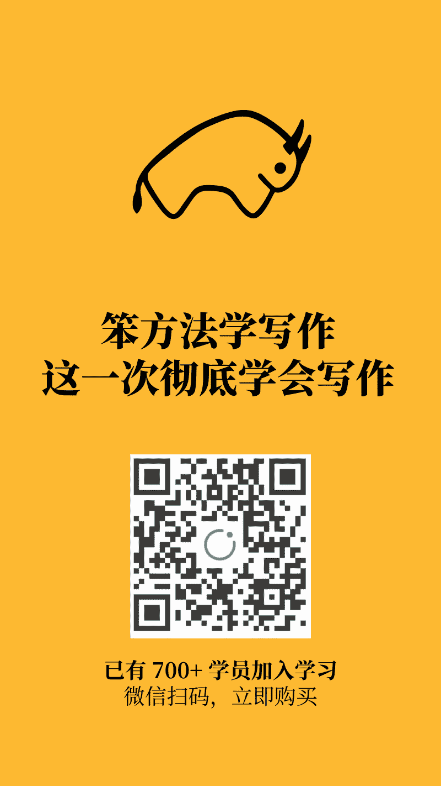

# 笨方法学写作：这一次彻底学会写作

> 来源：[`www.yuque.com/hardwaylab/book/luvhdr`](https://www.yuque.com/hardwaylab/book/luvhdr)

<ne-p id="u3a2d4784" data-lake-id="u3a2d4784"><ne-text id="uf1c834e4">无论时代如何变革，这两大矛盾会永远存在。</ne-text></ne-p> <ne-p id="u50ac5463" data-lake-id="u50ac5463"><ne-text id="uf924171f">一个是个人后天日益增长的知识需要与大脑先天容量有限之间的矛盾，另一个是个人现在对先进知识生产方式的需求与过去落后的知识处理方法之间的矛盾。</ne-text></ne-p> <ne-p id="ubb066e1e" data-lake-id="ubb066e1e"><ne-text id="u09173035">卡片创作的根本任务，是帮助你建立系统，解放与发展生产力，创作出更多产品。</ne-text></ne-p> <ne-p id="u33148f16" data-lake-id="u33148f16"><ne-text id="ue2a2ed05">卡片创作系统</ne-text><ne-text id="ucf799ac6">从 7 年前开始构建，并不断升级迭代，它已经彻底改变了我的创作过程，极大提高我的创造力。它已帮助我——</ne-text></ne-p> <ne-uli><ne-uli-i>●</ne-uli-i><ne-uli-c class="ne-uli-content" id="u7c129323" data-lake-id="u7c129323"><ne-text id="u82cbdfcb">开设《笨方法学写作》课程，目前已经有 730+ 人参与</ne-text></ne-uli-c></ne-uli> <ne-uli><ne-uli-i>●</ne-uli-i><ne-uli-c class="ne-uli-content" id="u5efe4477" data-lake-id="u5efe4477"><ne-text id="u420d5e88">完成 5 万+ 字的《笨方法文化手册》，已有 2000+ 人下载阅读</ne-text></ne-uli-c></ne-uli> <ne-uli><ne-uli-i>●</ne-uli-i><ne-uli-c class="ne-uli-content" id="u9c2f9c39" data-lake-id="u9c2f9c39"><ne-text id="udbbd8c1d">持续发布 60+ 篇《笨方法实验室来信》，已有 700+ 人订阅</ne-text></ne-uli-c></ne-uli> <ne-p id="u05674b9e" data-lake-id="u05674b9e"><ne-text id="ue23ba042">在多年的卡片实践中，我不仅在刻意增加卡片创作的次数，而且也在扩大其主题和应用范围，开始用「万物皆卡片」的角度去洞察与创作，不断尝试、调整、优化卡片创作在工作生活的每个环节，逐渐形成的一套适用于普通人的卡片创作系统。</ne-text></ne-p> <ne-p id="u998e7810" data-lake-id="u998e7810"><ne-text id="u4eb39dcc">这套卡片创作系统自 2019 年发布 2.0 版本以来，不断升级更新，至今历时 1128 天，终于发布 3.0 版本。这套系统当中每个问题都是我个人经历的困境，每个方法都是我亲身实践验证的假设，代表着我在解决卡片创作问题的最优解答与实践，它能有效调和创作的两大矛盾，提升生产力。</ne-text></ne-p> <ne-p id="ubadc6c84" data-lake-id="ubadc6c84"><ne-text id="u1cbe6a57">同时，这套卡片创作系统试图以文本驱动的创造主义来对抗消费主义，以产品与</ne-text>[<ne-text id="u502c1c60">身份</ne-text>](http://newsletter.hardwaylab.com/issues/issue-727965)<ne-text id="uf6f36220">驱动的长期主义对抗短期主义，持续用</ne-text>[<ne-text id="u2ba00c53">「持久战」</ne-text>](http://newsletter.hardwaylab.com/issues/3-718115)<ne-text id="u380b4933">与</ne-text>[<ne-text id="u83484a4d">「总体战」</ne-text>](http://newsletter.hardwaylab.com/issues/3-710518)<ne-text id="uc5d43c87">思想武装到日常生产、工作、学习和社会生活中，推动</ne-text>[<ne-text id="uff94ae0f">个人基建</ne-text>](http://newsletter.hardwaylab.com/issues/issue-721779)<ne-text id="u251b1fea">培养核心能力，用</ne-text>[<ne-text id="u474b01a9">实物工作量</ne-text>](http://newsletter.hardwaylab.com/issues/2-725333)<ne-text id="u3563e005">在关键项目做压倒性投入。</ne-text></ne-p> <ne-p id="u3b08d263" data-lake-id="u3b08d263"><ne-text id="ub3ff1535">现在，我邀请你加入这门课程，愿你的创作生生不息，繁荣昌盛。∎</ne-text></ne-p> <ne-h2 id="0dde8a3c" data-lake-id="0dde8a3c"><ne-heading-ext><ne-heading-anchor></ne-heading-anchor><ne-heading-fold></ne-heading-fold></ne-heading-ext><ne-heading-content><ne-text id="ufea2fb43">课程介绍</ne-text></ne-heading-content></ne-h2> <ne-p id="ueb49ffe9" data-lake-id="ueb49ffe9"><ne-card data-card-name="image" data-card-type="inline" id="u84cf73cd" data-event-boundary="card" class="ne-spacing-all"> <ne-card data-card-name="image" data-card-type="inline" id="u7e8f8a12" data-event-boundary="card" class="ne-spacing-all"><ne-card data-card-name="image" data-card-type="inline" id="u8bea627a" data-event-boundary="card" class="ne-spacing-all"><ne-card data-card-name="image" data-card-type="inline" id="u0a6460ff" data-event-boundary="card" class="ne-spacing-all"><ne-card data-card-name="image" data-card-type="inline" id="u3f5049ea" data-event-boundary="card" class="ne-spacing-all"><ne-card data-card-name="image" data-card-type="inline" id="uc60aae59" data-event-boundary="card" class="ne-spacing-all"><ne-card data-card-name="image" data-card-type="inline" id="uea91f97b" data-event-boundary="card" class="ne-spacing-all"><ne-h2 id="2df7de62" data-lake-id="2df7de62"><ne-heading-ext><ne-heading-anchor></ne-heading-anchor><ne-heading-fold></ne-heading-fold></ne-heading-ext><ne-heading-content><ne-text id="u806124f3">课程形式</ne-text></ne-heading-content></ne-h2> <ne-uli><ne-uli-i>●</ne-uli-i><ne-uli-c class="ne-uli-content" id="u53836f13" data-lake-id="u53836f13"><ne-text id="u3f137567">本课程为文字课程，有效期为一年，正式课程一共 42 节，共 5 个课程包，特训期起始每周更新 1 个课程包（P0 与 P1 打包更新），一共 28 天。</ne-text></ne-uli-c></ne-uli> <ne-uli><ne-uli-i>●</ne-uli-i><ne-uli-c class="ne-uli-content" id="uca41bca2" data-lake-id="uca41bca2"><ne-text id="u68f81746">本课程第 1 次特训期为 2022 年 2 月 28 日至 2022 年 3 月 27 日，特训期一年 4 次，可在一年内反复参加特训。</ne-text></ne-uli-c></ne-uli> <ne-uli><ne-uli-i>●</ne-uli-i><ne-uli-c class="ne-uli-content" id="u993034d5" data-lake-id="u993034d5"><ne-text id="u5be74946">本课程采用「知识星球+微信群」进行学习，学员可申请加入特训微信群，每天发布跟踪学习情况。</ne-text></ne-uli-c></ne-uli> <ne-uli><ne-uli-i>●</ne-uli-i><ne-uli-c class="ne-uli-content" id="ub27267e1" data-lake-id="ub27267e1"><ne-text id="ubcdd191d">此前加入知识星球，且有效期在 2022 年 3 月 27 前的学员，享受 3.0 待遇，可添加微信申请参加特训。老用户续费可自动享受优惠折扣。</ne-text></ne-uli-c></ne-uli> <ne-h2 id="1bbbb204" data-lake-id="1bbbb204"><ne-heading-ext><ne-heading-anchor></ne-heading-anchor><ne-heading-fold></ne-heading-fold></ne-heading-ext><ne-heading-content><ne-text id="ub52b64e9">注意事项</ne-text></ne-heading-content></ne-h2> <ne-uli><ne-uli-i>●</ne-uli-i><ne-uli-c class="ne-uli-content" id="ud1ae75ea" data-lake-id="ud1ae75ea"><ne-text id="u226d5b4f">本课程知识密度较大，实践性较强，值得购买后一年内反复操练。</ne-text></ne-uli-c></ne-uli> <ne-uli><ne-uli-i>●</ne-uli-i><ne-uli-c class="ne-uli-content" id="u1d9426ed" data-lake-id="u1d9426ed"><ne-text id="u1bedcaf8">特训周期内，需每天提交作业，学习强度较高，旨鼓励有所激有所逼，快速通关所有课程，然后再次反复练习。</ne-text></ne-uli-c></ne-uli> <ne-uli><ne-uli-i>●</ne-uli-i><ne-uli-c class="ne-uli-content" id="u4e347948" data-lake-id="u4e347948"><ne-text id="ud7f7667e">为什么要设置如此高强度：</ne-text>[<ne-text id="ued06028a">一项研究表明</ne-text>](https://digest.bps.org.uk/2021/12/21/watching-a-lecture-twice-at-double-speed-can-benefit-learning-better-than-watching-it-once-at-normal-speed/)<ne-text id="ub7bd26be">，观看学习视频时，两倍速看两遍比正常速度看一遍，效果更好。</ne-text></ne-uli-c></ne-uli> <ne-h2 id="5a00e4c2" data-lake-id="5a00e4c2"><ne-heading-ext><ne-heading-anchor></ne-heading-anchor><ne-heading-fold></ne-heading-fold></ne-heading-ext><ne-heading-content><ne-text id="u790fa95c">购前必读</ne-text></ne-heading-content></ne-h2> <ne-uli><ne-uli-i>●</ne-uli-i><ne-uli-c class="ne-uli-content" id="ubcbec47b" data-lake-id="ubcbec47b"><ne-text id="ua321ec60">如果你之前没有了解过笨方法，建议先搜索阅读</ne-text>[<ne-text id="ub5fbca5b">《笨方法文化手册》</ne-text>](https://www.yuque.com/hardwaylab/book)<ne-text id="u897b4626">再做决定。</ne-text></ne-uli-c></ne-uli> <ne-uli><ne-uli-i>●</ne-uli-i><ne-uli-c class="ne-uli-content" id="u8773fb7f" data-lake-id="u8773fb7f"><ne-text id="u278c54c3">本课程为虚拟内容服务，一经购买成功概不退款。</ne-text></ne-uli-c></ne-uli> <ne-uli><ne-uli-i>●</ne-uli-i><ne-uli-c class="ne-uli-content" id="u976df742" data-lake-id="u976df742"><ne-text id="u272dff60">在购买过程中，如遇到任何问题，可以添加微信寻求帮助，我会尽快回复。</ne-text></ne-uli-c></ne-uli></ne-card></ne-card></ne-card></ne-card></ne-card></ne-card></ne-card></ne-p>