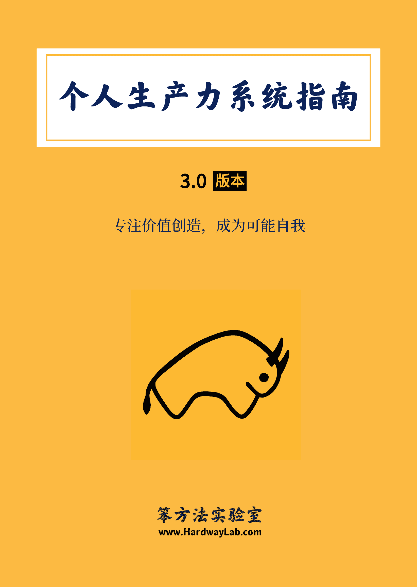

# 个人生产力系统指南：成为可能自我

> 来源：[`www.yuque.com/hardwaylab/book/gizm18`](https://www.yuque.com/hardwaylab/book/gizm18)

##   <ne-h2 id="e5DfW" data-lake-id="e5DfW">1

 

多数人并没有正确理解生产力。 

市面多见的生产力指南，第一是效率工具的使用，第二是时间管理的方法。 

生产力不是某个工具的功能介绍和使用技巧。 

许多创作者跟随这些工具指引去行动，以「工具」作为入口去提升生产力，这种方法虽然轻松简单，但会被工具主义与技术主义带错方向，导致在微观上更关注某个功能操作细节，而忘记使用这个工具的初衷与使命。 

生产力也不是更快更好地在待办事项清单上打勾。 

时间管理被包装成消灭忙碌的良药，列一堆任务清单，试图最大化地利用有限时间，制造一种控制一切的错觉，但事实是，时间管理本身制造出了另一种形式的忙碌，以忙碌覆盖忙碌。 

更加荒谬的是，你去做时间管理，并不是真的想去管理时间，而只是用正确的方式做成正确的事情，在你没有搞懂什么是正确的方式，什么是正确的事情之前，你时间管理得再好，但每分每秒都在原地打转，没有丝毫进步，你的付出就没有意义。 

## 2

 

什么才是生产力？ 

生产力，不单单局限在工具与工作领域，你不必时时追求更先进的笔记技术和工具，也不必经常保持自己处在忙碌状态。 

它是一套系统，它基于你对产品服务与自我身份的理解，然后针对你所拥有的时间、技能、智力、精力、资源和机会，进行深思熟虑的战略性投资与运作。 

它是一套指导方法，是价值理念、思考方式、生产方式与生产工具的知行合一，确保你在用正确的方式做成正确的事情。一旦你真的做到用正确的方式做成正确的事情，就无需时间管理。 

这套系统关注以人为本的效率提升，关注人生信念的持续实现，贯穿你的整个人生，实现并维护以下两种人生状态： 

一、当下身心富足，未来健康从容 

生产力是生活幸福感、创造心流、优秀工作习惯与趁手工具的结合，从而抵达身心富足的一种状态。 

它包括且不限于以下关键词：良好睡眠、饮食运动、坚定拒绝、专注简洁等。 

二、专注价值创造，成为可能自我 

生产力是勇于面对不确定，建立自我安全感，达成自我契约，专注价值创造，成为可能自我的过程。 

它包括且不限于以下关键词：终身学习、超越技能，自主优化、工作分发、自动化操作、效率工具等。 

## 3

 

好的生产力系统，不是只想把先进工具和高效工作方法告诉你，它像指南针，避免你被各种层出不穷的生产力工具带着走；它像是河流，能自动驱动你去寻找最优生产方法来优化工具组合；它像是火焰，赋予创作者的热情，点燃工具组合的最大价值。 

经过 8+ 年的实践，我总结了一套个人生产力系统，我用这套系统写出了《笨方法文化手册》、《笨方法学写作》和《发展写作学》，这套系统可产生价值，长期复用，以帮助你实现你的宏大构想，打造个人品牌，开发产品，打造社区，创造文化等。 

这套系统由产品系统、身份系统、生产系统组合而成， 即个人生产力三角形理论。 

它能促使你主动思考、学习、成长、持续改善，通过达成无数小进步，探索到更好的人生问题解决办法，让你宏观有耐心，微观有效率，成为可能自我。  

<ne-p id="uf8e60248" data-lake-id="uf8e60248">你可以在本指南中收获： 

## 内容大纲

 

本书综合我实践优化生产力的所有经验，全书分为 3 部分，共 9 万+ 字，220+ 页。  

## 2\. 社群服务

<ne-p id="u7ebe04aa" data-lake-id="u7ebe04aa">一经购买，永久更新，并加入本手册讨论社群，购买后请添加文末微信出示订单截图即可。  

## 购买须知

 

+   购买地址：[https://cie.h5.xeknow.com/s/2iNUXb](https://cie.h5.xeknow.com/s/2iNUXb) 

+   本指南为虚拟内容服务，一经购买成功概不退款，请您理解。 

+   如果你还没有购买过笨方法实验室相关课程，建议先搜索阅读[《笨方法文化手册》](https://www.yuque.com/hardwaylab/book)再做决定。 

+   本指南也是[笨方法实验室会员计划](https://www.yuque.com/hardwaylab/book/bq5a1v)的权益内容，订阅读者将免费获得该电子书。 

+   本指南不定期更新小版本，每年至少更新一次大版本。 

+   已购买用户，可查看过往订单下载最新版，申请加入社群。 <ne-uli ne-alignment="left">如遇到任何问题，可以添加微信寻求帮助，我会尽快回复。∎ 

### 

</ne-p></ne-p></ne-h2>