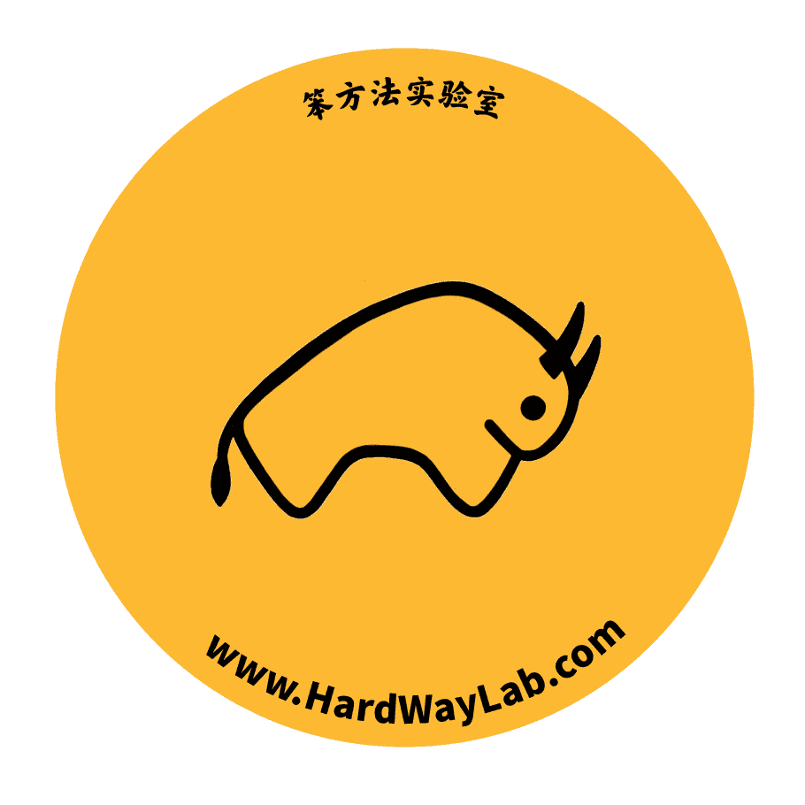
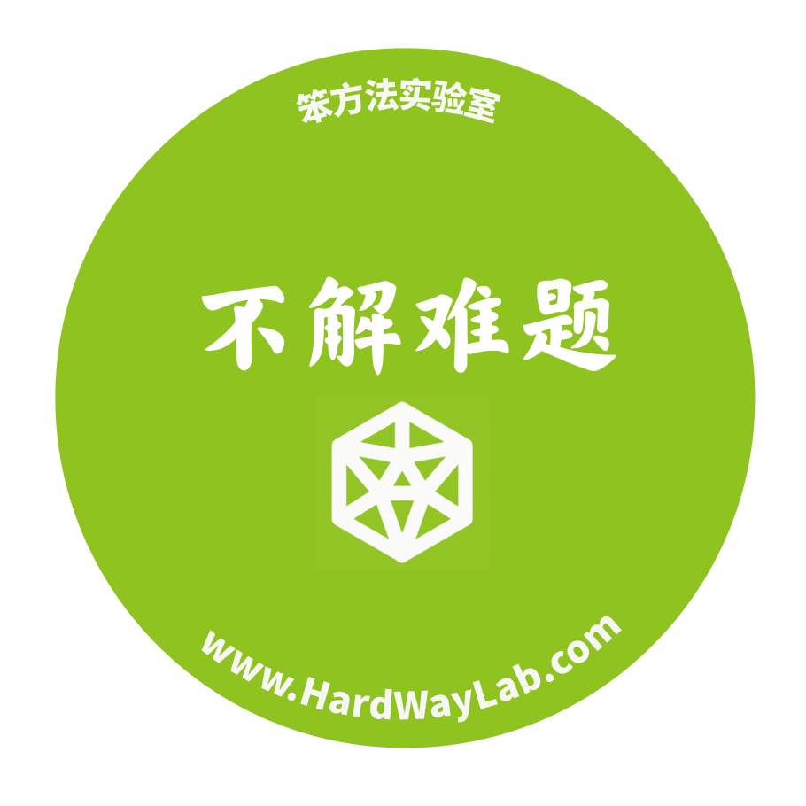
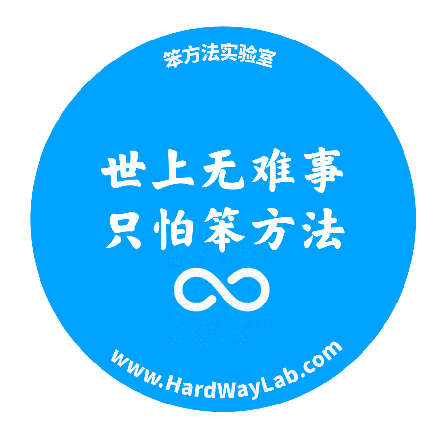
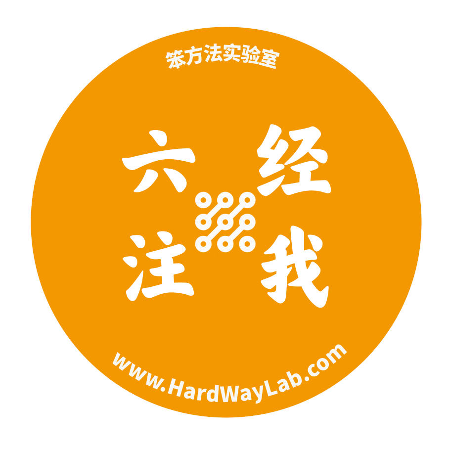
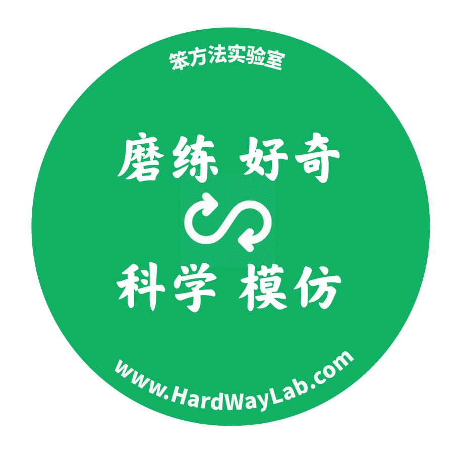

# 附：设计周边

> 来源：[`www.yuque.com/hardwaylab/book/tvf22k`](https://www.yuque.com/hardwaylab/book/tvf22k)

<ne-h3 id="y5f3l" data-lake-id="y5f3l"><ne-heading-ext><ne-heading-anchor></ne-heading-anchor><ne-heading-fold></ne-heading-fold></ne-heading-ext><ne-heading-content><ne-text id="ua1069eb1">品牌形象：黄牛</ne-text></ne-heading-content></ne-h3> <ne-p id="c85a8dc09c7642f537d1949cd203b505" data-lake-id="c85a8dc09c7642f537d1949cd203b505"><ne-text id="uccac6ba4">简单、勤奋、爱阅读、爱写作、爱分享、让生活变得充实、困难迎面而上、坚定不移、不屈不挠、对自己能力信心满满、接受平凡、不甘于平凡、谦虚低调好奇心、如饥似渴地学习知识……</ne-text></ne-p> <ne-h3 id="g0xoS" data-lake-id="g0xoS"><ne-heading-ext><ne-heading-anchor></ne-heading-anchor><ne-heading-fold></ne-heading-fold></ne-heading-ext><ne-heading-content><ne-text id="ucdb679ae">他会说</ne-text></ne-heading-content></ne-h3> <ne-p id="a9fc96842f2c9831019fea84459052ac" data-lake-id="a9fc96842f2c9831019fea84459052ac"><ne-text id="ubdd16add">不得贪胜、知识就是力量、跨学科学习、实事求是</ne-text></ne-p> <ne-h3 id="oXpjp" data-lake-id="oXpjp"><ne-heading-ext><ne-heading-anchor></ne-heading-anchor><ne-heading-fold></ne-heading-fold></ne-heading-ext><ne-heading-content><ne-text id="u12fe3162">最重要的品质</ne-text></ne-heading-content></ne-h3> <ne-p id="248ecadbeec0373f8e6f90f4289dd00d" data-lake-id="248ecadbeec0373f8e6f90f4289dd00d"><ne-text id="u7677b41e">乐观、诚实、内在驱动、探索、独立、挑战、坚毅、耐心、自律</ne-text></ne-p> <ne-h3 id="I93Bb" data-lake-id="I93Bb"><ne-heading-ext><ne-heading-anchor></ne-heading-anchor><ne-heading-fold></ne-heading-fold></ne-heading-ext><ne-heading-content><ne-text id="ubfb4985e">鄙视</ne-text></ne-heading-content></ne-h3> <ne-p id="0c0713d7b715f23c3151e6d00c1ad9ac" data-lake-id="0c0713d7b715f23c3151e6d00c1ad9ac"><ne-text id="u0a7b393e">虚伪、停滞、界限、放弃、一成不变、维持现状、苦苦等待、自满、算计</ne-text></ne-p> <ne-h3 id="gQ3AM" data-lake-id="gQ3AM"><ne-heading-ext><ne-heading-anchor></ne-heading-anchor><ne-heading-fold></ne-heading-fold></ne-heading-ext><ne-heading-content><ne-text id="u59aff3e9">对立面</ne-text></ne-heading-content></ne-h3> <ne-p id="351974216f1e32645f8cce6d3cfe63f8" data-lake-id="351974216f1e32645f8cce6d3cfe63f8"><ne-text id="u7368762c">消极、偏见、欺骗、逃避、放弃、傲慢、肤浅</ne-text></ne-p> <ne-h3 id="DIkcz" data-lake-id="DIkcz"><ne-heading-ext><ne-heading-anchor></ne-heading-anchor><ne-heading-fold></ne-heading-fold></ne-heading-ext><ne-heading-content><ne-text id="u2e9fc9ad">代表人物</ne-text></ne-heading-content></ne-h3> <ne-p id="4c788f79dea20d3fadb9fd4109d5d754" data-lake-id="4c788f79dea20d3fadb9fd4109d5d754"><ne-text id="udfdb2d84">巴菲特、芒格、Ray Dalio、司马贺、海明威、李昌镐、村上春树、李叔同、钱钟书、曾国藩、顾准、王阳明</ne-text></ne-p> <ne-h3 id="ujdrd" data-lake-id="ujdrd"><ne-heading-ext><ne-heading-anchor></ne-heading-anchor><ne-heading-fold></ne-heading-fold></ne-heading-ext><ne-heading-content><ne-text id="ub790cdb3">品牌特点</ne-text></ne-heading-content></ne-h3> <ne-p id="9a94b55d4a0da2f6d54329d6c9c89ec0" data-lake-id="9a94b55d4a0da2f6d54329d6c9c89ec0"><ne-text id="ucb0abafd">理性、创意、自由、开放、简单生活、鼓励探索发现、注重质量而不是外形和风格 ∎</ne-text></ne-p> <ne-p id="u8e05781f" data-lake-id="u8e05781f"><ne-card data-card-name="image" data-card-type="inline" id="EwOrg" data-event-boundary="card" class="ne-spacing-all"><ne-card data-card-name="image" data-card-type="inline" id="u8a6ba47d" data-event-boundary="card" class="ne-spacing-all"><ne-card data-card-name="image" data-card-type="inline" id="u5f561911" data-event-boundary="card" class="ne-spacing-all"><ne-card data-card-name="image" data-card-type="inline" id="u18fbce11" data-event-boundary="card" class="ne-spacing-all"><ne-card data-card-name="image" data-card-type="inline" id="ue5579a26" data-event-boundary="card" class="ne-spacing-all"></ne-card></ne-card></ne-card></ne-card></ne-card></ne-p>