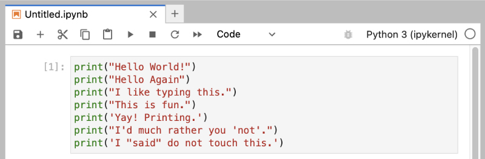
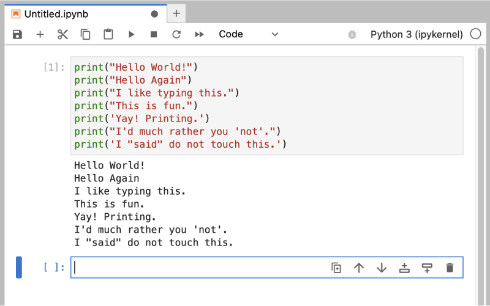

## 练习 1：一个好的第一个程序

警告！

如果你跳过了 Exercise 0，那么你就没有正确地进行这本书的学习。你是在尝试使用 IDLE 还是 IDE 吗？我在 Exercise 0 中说不要使用其中的任何一个，所以你也不应该使用。如果你跳过了 Exercise 0，请返回并阅读它。

你应该在 Exercise 0 中花费了相当多的时间学习如何安装 Jupyter，运行 Jupyter，运行终端，并且同时使用它们。如果你还没有这样做，那么请不要继续。你将度过不愉快的时光。这是我唯一一次在开始练习时警告你不要跳过或超前的时间。

在 Jupyter 单元格中输入以下文本：

列表 1.1: ex1.py

```py
1   **print(**"Hello World!"**)**
2   **print(**"Hello Again"**)**
3   **print(**"I like typing this."**)**
4   **print(**"This is fun."**)**
5   **print(**'Yay! Printing.'**)**
6   **print(**"I'd much rather you 'not'."**)**
7   **print(**'I "said" do not touch this.'**)**
```

你的 Jupyter 单元格应该看起来像这样：



不要担心如果你的 Jupyter 窗口看起来不完全相同；它应该是接近的。你的窗口标题可能略有不同，也许颜色略有不同，而你的 Jupyter 窗口的左侧不会相同，而是会显示你用于保存文件的目录。所有这些差异都是可以接受的。

当你创建这个单元格时，请记住这些要点：

1.  我没有在左侧输入行号。这些行号是在书中打印出来的，这样我就可以通过说“看第 5 行…”来谈论特定的行。你不需要在 Python 脚本中输入行号。

2.  我在行首有`print`，它看起来与我在单元格中的完全相同。完全意味着完全，不是有点类似。每个字符都必须匹配才能正常工作。颜色无关紧要，只有你输入的字符。

一旦它*完全*相同，你可以按下`SHIFT-ENTER`来运行代码。如果你做对了，那么你应该看到与我在本练习的*你应该看到的内容*部分相同的输出。如果没有，那么你做错了。不，计算机没有错。

### 你应该看到的内容

在你按住`SHIFT`并按下`ENTER`后，Jupyter 的输出将如下所示（我会写成`SHIFT-ENTER`）：



你可能会看到不同的窗口外观和布局，但重要的是你输入命令并查看输出与我的相同。

如果出现错误，它会看起来像这样：

```py
1   Cell In[1], line 3
2     print("I like typing this.
3           ^
4   SyntaxError: unterminated string literal (detected at line 1)
```

重要的是你能够阅读这些错误消息，因为你将犯许多这样的错误。即使我也会犯许多这样的错误。让我们逐行查看这个。

1.  我们使用`SHIFT-ENTER`在 Jupyter 单元格中运行了我们的命令。

2.  Python 告诉我们该单元格在第 3 行有一个错误。

3.  它为我们打印出这行代码以供查看。

4.  然后它放置一个`^`（插入符）字符指向问题所在的地方。注意结尾缺少`"`（双引号）字符了吗？

5.  最后，它会打印出一个“SyntaxError”并告诉我们可能的错误。通常这些错误非常难以理解，但如果你将该文本复制到搜索引擎中，你会找到其他遇到过这个错误的人，并且你可能会弄清楚如何修复它。

### 学习练习

学习练习包含你应该*尝试*做的事情。如果你做不到，跳过它，稍后再回来。

对于这个练习，请尝试这些事情：

1.  让你的脚本打印另一行。

2.  让你的脚本只打印一行。

3.  在一行的开头放一个`#`（井号）字符。它有什么作用？试着找出这个字符的作用。

从现在开始，除非练习有所不同，否则我不会解释每个练习的工作原理。

信息

“井号”也被称为“磅”，“井号”，“网格”或任何一种名称。选择让你放松的那个。

### 常见学生问题

这些是真实学生在做这个练习时提出的*实际*问题：

**我可以使用 IDLE 吗？** 不，现在只使用 Jupyter，稍后我们将使用常规文本编辑器获得额外的超能力。

**在 Jupyter 中编辑代码很烦人。我可以使用文本编辑器吗？** 完全可以，你也可以在 Jupyter 中创建一个`python`文件并获得一个“足够好”的编辑器。在左侧面板中看到所有文件的地方，点击左上角的`+`（加号）图标。这将带你到你开始 Jupyter 时看到的第一个屏幕。在底部的`$_ Other`下，你会看到一个带有 Python 标志的`Python` `File`按钮。点击它，你将获得一个编辑器来处理你的文件。

**我的代码无法运行；我只是得到一个没有输出的提示符**。你很可能字面上采用了我的单元格中的代码，并认为`print("Hello World!")`意味着只在单元格中输入`"Hello` `World!"`，而不包括`print`。你的单元格必须*完全*像我的一样。
