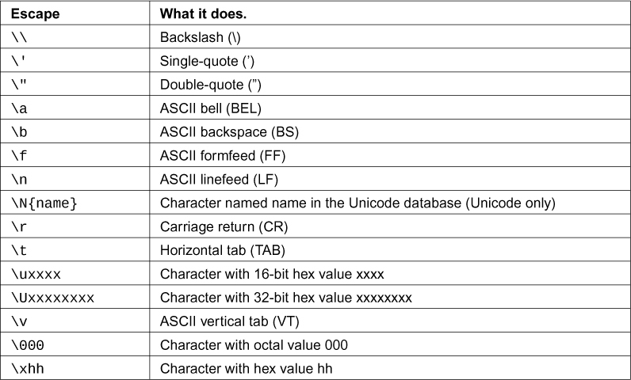

## 第 10 题. 字符串中的转义代码

在第 9 题中，我给你一些新东西，只是为了让你保持警惕。我向你展示了两种跨越多行的字符串的方法。在第一种方法中，我在月份名称之间放置了字符`\n`（反斜杠`n`）。这两个字符在该点将一个`换行字符`放入字符串中。

这个`\`（反斜杠）字符将难以输入的字符编码到字符串中。有各种不同的“转义序列”可用于你可能想要使用的不同字符。我们将尝试一些这些序列，这样你就能明白我的意思。

一个重要的转义序列是转义单引号`'`或双引号`"`。想象一下，你有一个使用双引号的字符串，而你想在字符串中放一个双引号。如果你写`"我 "理解" 乔。"`，那么 Python 会感到困惑，因为它会认为`"`在`"理解"`周围实际上*结束*了字符串。你需要一种方法告诉 Python，字符串中的`"`不是*真正的*双引号。

要解决这个问题，你需要*转义*双引号和单引号，这样 Python 才知道将它们包含在字符串中。这里有一个例子：

```py
"I am 6'2\" tall." # escape double-quote inside string
'I am 6\'2" tall.' # escape single-quote inside string
```

解决这个问题的第二种方法是使用三引号，即`"""`，它的工作方式类似于字符串，但你也可以放置任意行的文本，直到再次键入`"""`。我们也会玩一下这些。

代码清单 10.1: ex10.py

```py
 1   tabby_cat = "\tI'm tabbed in."
 2   persian_cat = "I'm split\non a line."
 3   backslash_cat = "I'm \\ a \\ cat."
 4
 5   fat_cat = """
 6   I'll do a list:
 7   \t* Cat food
 8   \t* Fishies
 9   \t* Catnip\n\t* Grass
10   """
11
12   **print(**tabby_cat**)**
13   **print(**persian_cat**)**
14   **print(**backslash_cat**)**
15   **print(**fat_cat**)**
```

### 你应该看到的内容

寻找你制作的制表符。在这个练习中，正确的间距很重要。

```py
 1           I'm tabbed in.
 2   I'm split
 3   on a line.
 4   I'm \ a \ cat.
 5
 6   I'll do a list:
 7           * Cat food
 8           * Fishies
 9           * Catnip
10           * Grass
```

### 转义序列

这是 Python 支持的所有转义序列。你可能不会使用其中许多，但无论如何要记住它们的格式和功能。尝试在一些字符串中使用它们，看看能否让它们起作用。



### 学习练习

1.  通过将它们放在闪存卡上来记忆所有的转义序列。

2.  使用`'''`（三个单引号）代替。你能看出为什么你可能会使用它而不是`"""`吗？

3.  结合转义序列和格式字符串创建更复杂的格式。

### 常见学生问题

**我还没有完全弄清楚最后一个练习。我应该继续吗？** 是的，继续。不要停下来，记下你对每个练习不理解的事情。定期查看你的笔记，看看在完成更多练习后是否能弄清楚这些事情。有时候，你可能需要回头做几个练习。

**是什么让** // **与其他的不同？** 这只是你会写出一个反斜杠（`\`）字符的方式。想想为什么你会需要这个。

**当我写** `//` **或** `/n` **时它不起作用**。那是因为你使用的是正斜杠`/`而不是反斜杠`\`。它们是不同的字符，做着非常不同的事情。

**我不明白练习 3。你说的“结合”转义序列和格式是什么意思？** 我需要你理解的一个概念是，这些练习可以结合起来解决问题。利用你对格式化字符串的了解，编写一些新代码，使用格式化字符串*和*这个练习中的转义序列。

**哪个更好，** `'''` **还是** `"""`**？** 这完全取决于风格。现在选择`'''`（三个单引号）风格，但要准备根据感觉或其他人的做法选择其中之一。
