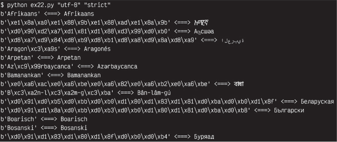
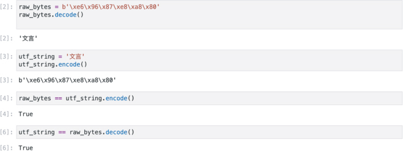
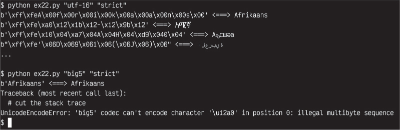

## 练习 22. 字符串、字节和字符编码

要完成这个练习，你需要*下载*一个我写的名为`languages.txt`的文本文件。这个文件是用人类语言列表创建的，以演示一些有趣的概念：

• 现代计算机如何存储人类语言以供显示和处理，以及 Python 3 如何称呼这些`字符串`

• 你必须将 Python 的字符串“编码”和“解码”为一种称为`bytes`的类型

• 如何处理字符串和字节处理中的错误

• 如何阅读代码并找出其含义，即使你以前从未见过它

你可以通过用鼠标`右键单击`并选择“下载”来可靠地下载这个文件。使用链接[`learnpythonthehardway.org/python3/languages.txt`](https://learnpythonthehardway.org/python3/languages.txt)来下载这个文件。

此外，你将简要了解 Python 3 中的`if 语句`和`列表`，用于处理一系列事物。你不必立即掌握这段代码或理解这些概念。你将在后续练习中有足够的练习。现在你的任务是尝试未来并学习前述列表中的四个主题。

警告！

这个练习很难！里面有很多你需要理解的信息，而且这些信息深入到计算机内部。这个练习很复杂，因为 Python 的字符串很复杂且难以使用。我建议你慢慢来完成这个练习。写下你不理解的每个词，然后查找或研究它。如果必要，一段一段地进行。你可以在学习这个练习的同时继续进行其他练习，所以不要在这里卡住。只要花费足够长的时间逐步解决它。

### 初始研究

你将创建一个名为`ex22.py`的文件，并在 shell 中运行它以完成这个练习。确保你知道如何做到这一点，如果不知道，可以回顾练习 0 中学习如何从终端运行 Python 代码。

我将教你如何研究一段代码以揭示其秘密。你需要`[languages](https://learnpythonthehardway.org/python3/languages.txt).` ↪ `[txt](https://learnpythonthehardway.org/python3/languages.txt)`文件才能使这段代码工作，所以确保你首先下载它。`languages.txt`文件简单地包含了一些以 UTF-8 编码的人类语言名称。

列表 22.1：ex22.py

```py
 1   **import** sys
 2   script, input_encoding, error = sys.argv
 3
 4
 5   **def** main**(**language_file, encoding, errors**)**:
 6       line = language_file.readline**()**
 7
 8       **if** line:
 9           print_line**(**line, encoding, errors**)**
10           **return** main**(**language_file, encoding, errors**)**
11
12
13   **def** print_line**(**line, encoding, errors**)**:
14       next_lang = line.strip**()**
15       raw_bytes = next_lang.encode**(**encoding, errors=errors**)**
16       cooked_string = raw_bytes.decode**(**encoding, errors=errors**)**
17
18       **print(**raw_bytes, "<===>", cooked_string**)**
19
20
21   languages = **open(**"languages.txt", encoding="utf-8"**)**
22
23   main**(**languages, input_encoding, error**)**
```

尝试通过写下你不认识的每一样东西来研究这段代码，然后用通常的`python THING site:python.org`搜索它。例如，如果你不知道`encode()`是什么意思，那么搜索`python encode site:python.org`。一旦你阅读了所有你不了解的东西的文档，继续进行这个练习。

一旦你拥有了这个文件，你会想要在你的 shell 中运行这个 Python 脚本来测试它。以下是我用来测试它的一些示例命令：

```py
1   python ex22.py "utf-8" "strict"
2   python ex22.py "utf-8" "ignore"
3   python ex22.py "utf-8" "replace"
```

查看`[str.encode()](https://docs.python.org/3/library/stdtypes.xhtml#str.encode)`函数的文档以获取更多选项。

警告！

你会注意到我在这里使用图片来展示你应该看到的内容。经过广泛测试，结果表明很多人的计算机配置为不显示 utf-8，所以我不得不使用图片，这样你就知道可以期待什么。甚至我的排版系统（LaTeX）也无法处理这些编码，迫使我使用图片。如果你看不到这个，那么你的终端很可能无法显示 utf-8，你应该尝试解决这个问题。

这些示例使用`utf-8`、`utf-16`和`big5`编码来演示转换和可能出现的错误类型。在 Python 3 中，这些名称中的每一个被称为“编解码器”，但你使用参数“encoding”。在这个练习的结尾，有一个可用编码的列表，如果你想尝试更多的话。我很快会解释这些输出的含义。你只是试图了解这是如何工作的，这样我们就可以讨论它。

在运行几次之后，浏览一下你的符号列表，猜一下它们的作用。当你写下你的猜测时，尝试在线查找这些符号，看看你是否能够确认你的假设。如果你不知道如何搜索它们，不要担心。试一试。

### 开关、约定和编码

在我解释这段代码的含义之前，你需要了解一些关于计算机中数据存储的基础知识。现代计算机非常复杂，但在它们的核心，它们就像一个巨大的光开关阵列。计算机使用电力来开关打开或关闭。这些开关可以表示 1 为开，0 为关。在过去，有各种奇怪的计算机不仅仅是 1 或 0，但如今只有 1 和 0。一个代表能量、电力、开、电源、物质。零代表关闭、完成、消失、关机、能量的缺乏。我们称这些 1 和 0 为“比特”。

现在，一台只能使用 1 和 0 来工作的计算机既效率低下又令人讨厌。计算机使用这些 1 和 0 来编码更大的数字。在较小的范围内，计算机将使用 8 个这些 1 和 0 来编码 256 个数字（0-255）。但“编码”是什么意思呢？这不过是一种约定俗成的标准，规定了一系列位应该如何表示一个数字。这是人类选择或偶然发现的一种约定，它说`00000000`将是 0，`11111111`将是 255，而`00001111`将是 15。甚至在计算机早期历史上，甚至有关于这些位的顺序的巨大战争，因为它们只是我们都必须同意的约定。

今天我们将“字节”称为 8 位（1 和 0 的序列）。在旧时代，每个人都有自己的字节约定，所以你仍然会遇到认为这个术语应该灵活处理 9 位、7 位、6 位序列的人，但现在我们只说它是 8 位。这是我们的约定，这个约定定义了我们对字节的编码。对于使用 16、32、64 甚至更多位的大数字进行编码还有进一步的约定，如果你涉及到非常大的数学，会有整个标准组织专门讨论这些约定，然后将它们实现为最终打开和关闭开关的编码。

一旦你有了字节，你就可以开始通过决定另一种约定来将数字映射到字母来存储和显示文本。在计算机早期，有许多约定将 8 位或 7 位（或更少或更多）映射到计算机内部保存的字符列表上。最流行的约定最终成为了美国信息交换标准代码，即 ASCII。这个标准将一个数字映射到一个字母。数字 90 是 Z，在位上是`1011010`，这被映射到计算机内部的 ASCII 表中。

你现在可以在 Python 中尝试这个：

```py
1   >>> 0b1011010
2   90
3   >>> ord('Z')
4   90
5   >>> chr(90)
6   'Z'
7   >>>
```

首先，我将数字 90 写成二进制，然后根据字母 Z 得到数字，最后将数字转换为字母 Z。不过不用担心需要记住这个过程。我想我在使用 Python 的整个时间里只不过做过两次。

一旦我们有了使用 8 位（一个字节）编码字符的 ASCII 约定，我们就可以将它们“串”在一起形成一个单词。如果我想写我的名字“Zed A. Shaw”，我只需使用一个字节序列`[90, 101, 100, 32, 65, 46, 32, 83, 104, 97, 119]`。计算机早期的大部分文本只不过是存储在内存中的字节序列，计算机用来向人显示文本。同样，这只是一系列约定，用来打开和关闭开关。

ASCII 的问题在于它只编码英语和可能还有一些其他类似的语言。记住一个字节可以存储 256 个数字（0-255，或 00000000-11111111）。事实证明，世界上的语言中使用的字符远远超过 256 个。不同国家为他们的语言创建了自己的编码约定，这在大多数情况下是有效的，但许多编码只能处理一种语言。这意味着，如果你想在泰语句子中间放置一本美国英语书的标题，你可能会遇到麻烦。你需要一个编码用于泰语，另一个用于英语。

为了解决这个问题，一群人创造了 Unicode。它听起来像“编码”，旨在成为所有人类语言的“通用编码”。Unicode 提供的解决方案类似于 ASCII 表，但相比之下要庞大得多。你可以使用 32 位来编码一个 Unicode 字符，这比我们可能找到的字符还要多。32 位数字意味着我们可以存储 4,294,967,295 个字符（2³²），这足够容纳每种可能的人类语言，也可能包括很多外星语言。现在我们利用额外的空间来存储重要的事物，比如粑粑和笑脸表情符号。

现在我们有了一个编码任何字符的约定，但 32 位等于 4 字节（32/8 == 4），这意味着在我们想要编码的大多数文本中有很多浪费的空间。我们也可以使用 16 位（2 字节），但大多数文本仍然会有浪费的空间。解决方案是使用一个巧妙的约定，使用 8 位来编码大多数常见字符，然后在需要编码更多字符时“转义”为更大的数字。这意味着我们有了一个不过是压缩编码的约定，使得大多数常见字符可以使用 8 位，然后根据需要转换为 16 或 32 位。

在 Python 中编码文本的约定称为“utf-8”，意思是“Unicode 转换格式 8 位”。这是一种将 Unicode 字符编码为字节序列（即位序列（将开关序列打开和关闭））的约定。你也可以使用其他约定（编码），但 utf-8 是当前的标准。

### 解析输出

现在我们可以看一下之前命令的输出。让我们仅看一下第一个命令和输出的前几行：



`ex22.py` 脚本将写在 `b''`（字节字符串）内的字节转换为你指定的 UTF-8（或其他）编码。左侧是每个 utf-8 字节的数字（以十六进制显示），右侧是实际的 utf-8 字符输出。这样想，`<===>` 的左侧是 Python 的数字字节，或者 Python 用来存储字符串的“原始”字节。你使用 `b''` 来告诉 Python 这是“字节”。然后这些原始字节会在右侧“烹饪”显示，这样你就可以在终端中看到真实的字符。

### 解析代码

我们已经了解了字符串和字节序列。在 Python 中，`string` 是一个 UTF-8 编码的字符序列，用于显示或处理文本。然后字节是 Python 用来存储这个 UTF-8 `string` 的“原始”字节序列，并以 `b'` 开头告诉 Python 你正在处理原始字节。这一切都基于 Python 处理文本的约定。这里是一个 Python 会话，展示了我如何编码字符串和解码字节：



你需要记住的是，如果你有原始字节，那么你必须使用`.decode()`来获取`string`。原始`bytes`没有约定。它们只是一系列没有其他含义的字节，所以你必须告诉 Python“将其解码为 utf 字符串”。如果你有一个字符串并想要发送、存储、共享或执行其他操作，通常它会工作，但有时 Python 会抛出一个错误，说它不知道如何“编码”它。再次强调，Python 知道它的内部约定，但不知道你需要什么约定。在这种情况下，你必须使用`.encode()`来获取你需要的字节。

要记住这一点（尽管我几乎每次都要查找），方法是记住“DBES”这个记忆口诀，它代表“Decode Bytes Encode Strings”。当我需要转换字节和字符串时，我会在脑海中说“dee bess”。当你有`bytes`并需要一个`string`时，“Decode Bytes”。当你有一个字符串并需要字节时，“Encode Strings”。

有了这个想法，让我们逐行分解`ex22.py`中的代码：

**1-2** 我从你已经了解的常规命令行参数处理开始。

**5** 我在一个方便命名为`main`的函数中开始这段代码的主要部分。这将在脚本末尾调用以启动事务。

**6** 这个函数的第一件事是从给定的语言文件中读取一行。你以前做过这个，所以这里没有什么新东西。处理文本文件时，就像以前一样只需`readline`。

**8** 现在我使用了一些*新*的东西。你将在本书的后半部分了解到这一点，所以把它看作是即将发生的有趣事情的一个预告。这是一个`if`语句，它让你在 Python 代码中做出决策。你可以“测试”一个变量的真实性，并根据这个真实性运行一段代码或不运行它。在这种情况下，我正在测试`line`是否有内容。当`readline`到达文件末尾时，`readline`函数将返回一个空字符串，而`if` `line`只是测试这个空字符串。只要`readline`给我们一些东西，这将是真的，代码*在*（缩进，第 9-10 行）将运行。当这是假的时候，Python 将跳过 9-10 行。

**9** 然后我调用一个单独的函数来实际打印这一行。这简化了我的代码，使我更容易理解它。如果我想了解这个函数的作用，我可以跳转到它并进行研究。一旦我知道`print_line`做什么，我就可以将我的记忆与名称`print_line`联系起来，然后忘记细节。

**10** 我在这里写了一小段强大的魔法。我在`main`函数内部再次调用`main`。实际上，这并不是魔法，因为在编程中没有什么是真正神奇的。所有你需要的信息都在那里。这看起来像是我在函数*内部*调用它自己，这似乎应该是不合法的。问问自己，为什么这应该是不合法的？从技术上讲，我可以在那里调用任何函数，甚至是这个`main`函数，没有任何技术上的理由不允许这样做。如果一个函数只是一个跳转到我命名为`main`的顶部的地方，那么在函数末尾调用这个函数会……跳回到顶部并再次运行它。这将使它循环。现在回顾一下第 8 行，你会看到`if 语句`阻止了这个函数无限循环。仔细研究这一点，因为这是一个重要的概念，但如果你不能立刻理解也不要担心。

**13** 我现在开始定义`print_line`函数，该函数实际上对`languages.txt`文件中的每一行进行编码。

**14** 这只是简单地去除`line`字符串末尾的`\n`。

**15** 现在我*终于*拿到了从`languages.txt`文件中收到的语言，并将其“编码”为原始字节。记住“DBES”这个助记符。“解码字节，编码字符串。”`next_lang`变量是一个字符串，所以为了获得原始字节，我必须在其上调用`.encode()`来“编码字符串”。我传递给`encode()`我想要的编码以及如何处理错误。

**16** 然后我通过从`raw_bytes`创建一个`cooked_string`变量来展示第 15 行的反向操作。记住，“DBES”告诉我“解码字节”，而`raw_bytes`是`bytes`，所以我在其上调用`.decode()`来获得一个 Python`string`。这个字符串应该与`next_lang`变量相同。

**18** 然后我简单地将它们都打印出来，以展示它们的样子。

**21** 我已经定义完函数，现在我想打开`languages.txt`文件。

**23** 脚本的结尾简单地运行`main`函数，带上所有正确的参数来启动一切并启动循环。记住，这会跳转到第 5 行定义`main`函数的地方，然后在第 10 行再次调用`main`，导致这个循环继续进行。第 8 行的`if line:`将阻止我们的循环永远进行下去。

### 深入探讨编码

现在我们可以使用我们的小脚本来探索其他编码。这是我尝试不同编码并看如何破解它们的过程：



首先，我正在做一个简单的 UTF-16 编码，这样你就可以看到它与 UTF-8 相比是如何变化的。你也可以使用“utf-32”来看看它更大，以及用 UTF-8 节省的空间的概念。之后我尝试 Big5，你会发现 Python*一点也不*喜欢那个。它会抛出一个错误，说“big5”无法对位置 0 的一些字符进行编码（这非常有帮助）。一个解决方案是告诉 Python 用“replace”替换任何 Big5 编码系统中不匹配的字符。尝试一下，你会看到它在发现一个不符合 Big5 编码系统的字符时会放置一个`?`字符。

### 破坏它

粗略的想法包括以下内容：

1\. 找到用其他编码编码的文本字符串，并将它们放入`ex22.py`文件中，看看会发生什么。

2\. 找出当你提供一个不存在的编码时会发生什么。

3\. 额外挑战：使用`b''`字节来重写这个脚本，而不是使用 UTF-8 字符串，有效地颠倒脚本。

4\. 如果你能做到这一点，那么你也可以通过删除一些字节来*破坏*这些字节，看看会发生什么。你需要删除多少才能让 Python 崩溃？你可以删除多少来损坏字符串输出但通过 Python 的解码系统吗？

5\. 利用从第 4 步学到的知识，看看是否可以搞乱文件。你会得到什么错误？你能造成多大破坏并让文件通过 Python 的解码系统吗？
