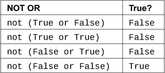

## 练习 28：记忆逻辑

今天是你开始学习逻辑的一天。到目前为止，你已经尽可能地阅读和写入文件，使用终端，并且已经学会了 Python 的许多数学功能。

从现在开始，你将学习*逻辑*。你不会学习学术界喜欢研究的复杂理论，而只会学习使真实程序运行并且真正的程序员每天都需要的简单基本逻辑。

学习逻辑必须在你进行一些记忆工作之后进行。我希望你能坚持做这个练习整整一个星期。即使你感到无聊透顶，也要坚持下去。这个练习有一组逻辑表格，你必须记住它们，以便让你更容易完成后面的练习。

我警告你，一开始这可能不会很有趣。这将会非常无聊和乏味，但这会教会你作为程序员所需要的一项非常重要的技能。你*将*需要能够记忆生活中重要的概念。一旦你掌握了这些概念，大多数都会变得令人兴奋。你将与之奋斗，就像与章鱼搏斗一样，然后有一天你会理解它。所有记忆基础知识的工作以后会有很大的回报。

以下是一个提示，如何在不发疯的情况下记忆某些内容：每天分散一点时间进行学习，并记录下你最需要重点学习的内容。不要试图连续坐下两个小时来记忆这些表格。这样做是不会奏效的。你的大脑只会记住你最开始学习的 15 或 30 分钟的内容。相反，创建一堆索引卡，每一列在正面（True 或 False），背面是对应的列。然后拿出来，看到“True 或 False”立即说“True！”不断练习直到能够做到这一点。

一旦你能做到这一点，每天晚上开始在笔记本上写下自己的真值表。不要只是复制它们。尝试从记忆中完成。当遇到困难时，快速瞥一眼我这里的表格以刷新记忆。这样做将训练你的大脑记住整个表格。

不要花费超过一周的时间在这上面，因为你将在学习过程中应用它。

### 真值术语

在 Python 中，我们有以下术语（字符和短语）来确定某些东西在程序中是否为“True”或“False”。计算机上的逻辑完全是关于查看这些字符和一些变量的组合在程序的某一点是否为 True。

+   `and`

+   `or`

+   `not`

+   `!=`（不等于）

+   `==`（等于）

+   `>=`（大于等于）

+   `<=`（小于等于）

+   `True`

+   `False`

你实际上之前已经遇到过这些字符，只是可能不是这些术语。这些术语（and、or、not）实际上的工作方式与你期望的一样，就像英语中一样。

### 真值表

现在我们将使用这些字符制作你需要记忆的真值表。首先是`not X`的表：

这是`X or Y`的表格：

现在是`X and Y`的表格：

接下来是`not`与`or`组合的表格，即`not (X or Y)`：

你应该将这些表格与`or`和`and`的表格进行比较，看看是否注意到了模式。这是`not (X and Y)`的表格。如果你能找出模式，也许就不需要记忆它们了。

现在我们来讨论等式，即以各种方式测试一件事是否等于另一件事。首先是`X != Y`：

最后是`X == Y`：

现在使用这些表格编写你自己的卡片，并花一周时间记忆它们。请记住，这本书中没有失败，只有每天尽力而为，然后再多努力一点。

### 常见学生问题

**我不能只学习布尔代数背后的概念而不记忆这些吗？** 当然可以，但那样的话，你在编码时就必须不断查阅布尔代数的规则。如果你先记忆这些，不仅可以提高你的记忆能力，而且使这些操作变得自然。之后，布尔代数的概念就很容易了。但请按照适合你的方式去做。
