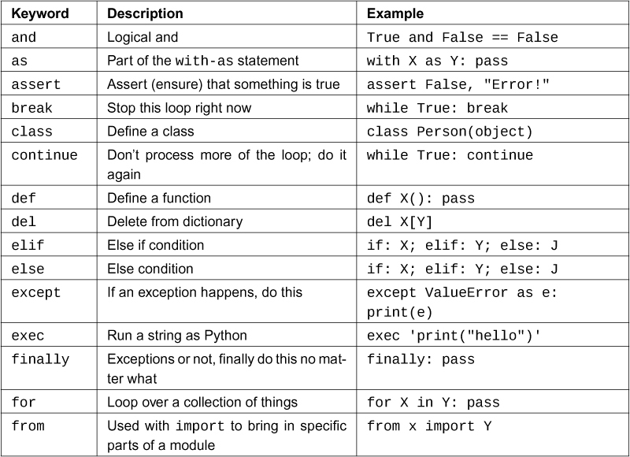
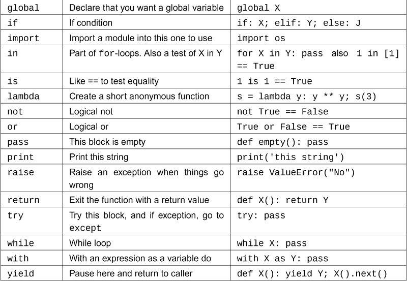
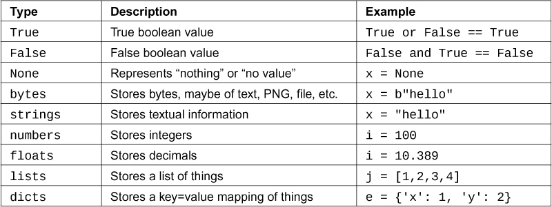
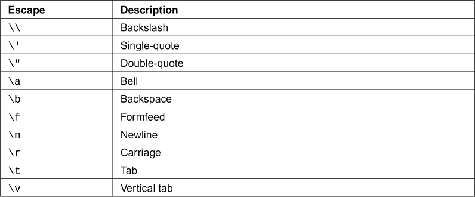
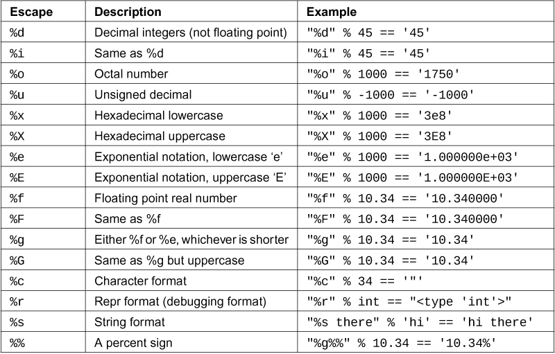
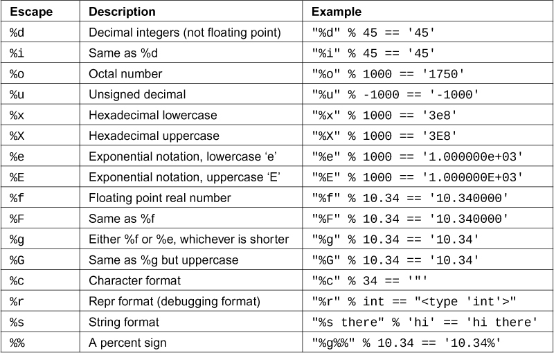

## 练习 37：符号复习

现在是时候复习你所知道的符号和 Python 关键字，并尝试在接下来的几节课中学习更多。我已经列出了所有重要的 Python 符号和关键字。

在这节课中，首先尝试从记忆中写出每个关键字的作用。接下来，在网上搜索它们，看看它们真正的作用。这可能很困难，因为有些很难搜索，但无论如何都要尝试。

如果你从记忆中记错了其中一个，就制作一张正确定义的索引卡，尝试“纠正”你的记忆。

最后，在一个小的 Python 程序中使用这些中的每一个，或者尽可能多地完成。目标是找出符号的作用，确保你理解正确，如果不正确就纠正，然后使用它来牢记。

### 关键字

### 数据类型

对于数据类型，写出每种数据类型的组成部分。例如，对于字符串，写出如何创建一个字符串。对于数字，写出一些数字。

### 字符串转义序列

对于字符串转义序列，将它们用在字符串中，确保它们执行你认为的操作。

### 旧式字符串格式

对于字符串格式也是一样：在一些字符串中使用它们，以了解它们的作用。

旧版 Python 2 代码使用这些格式化字符来实现 f-strings 的功能。尝试它们作为替代方案。

### 运算符

其中一些可能对你来说很陌生，但无论如何都要查找它们。找出它们的作用，如果你仍然无法弄清楚，就留到以后再看。

大约花一周的时间，但如果你更快完成，那就太好了。重点是尝试覆盖所有这些符号，并确保它们牢记在你的脑海中。同样重要的是找出你*不*知道的东西，这样你就可以以后修复它。

### 阅读代码

现在找一些 Python 代码来阅读。你应该阅读任何你能找到的 Python 代码，并尝试窃取你发现的想法。你实际上应该有足够的知识来阅读，但也许不理解代码的作用。这节课教你如何应用你学到的东西来理解别人的代码。

首先，打印出你想要理解的代码。是的，打印出来，因为你的眼睛和大脑更习惯于阅读纸张而不是电脑屏幕。确保每次打印几页。

其次，浏览你的打印输出，并对以下内容做笔记：

1.  函数及其作用。

2.  每个变量首次被赋值的地方。

3.  程序中不同部分中具有相同名称的任何变量。这些以后可能会有麻烦。

4.  没有`else`子句的`if`语句。它们正确吗？

5.  任何可能不会结束的`while`循环。

6.  任何你因为任何原因无法理解的代码部分。

第三，一旦你标记了所有这些，尝试通过写注释来向自己解释。解释函数，它们如何被使用，涉及哪些变量以及你可以找出这段代码的任何内容。

最后，在所有困难的部分，逐行追踪每个变量的值，逐个函数地。实际上，再做一份打印输出，并在边缘写下你需要“追踪”的每个变量的值。

一旦你对代码的功能有了很好的理解，回到电脑上再次阅读它，看看是否能发现新的东西。继续找到更多的代码并这样做，直到你不再需要打印输出为止。

### 学习练习

1.  找出“流程图”是什么，并画几个。

2.  如果你在阅读代码时发现错误，请尝试修复它们，并将更改发送给作者。

3.  当你不使用纸张时的另一种技巧是在代码中用`#`注释来记录你的笔记。有时，这些注释可能成为实际的注释，帮助下一个人。

### 常见学生问题

**我该如何在网上搜索这些内容？** 只需在你想要查找的任何内容前加上“python3”。例如，要查找`yield`，搜索`python3 yield`。
