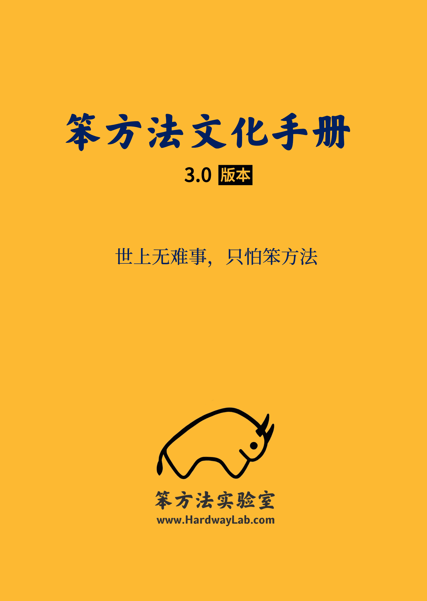
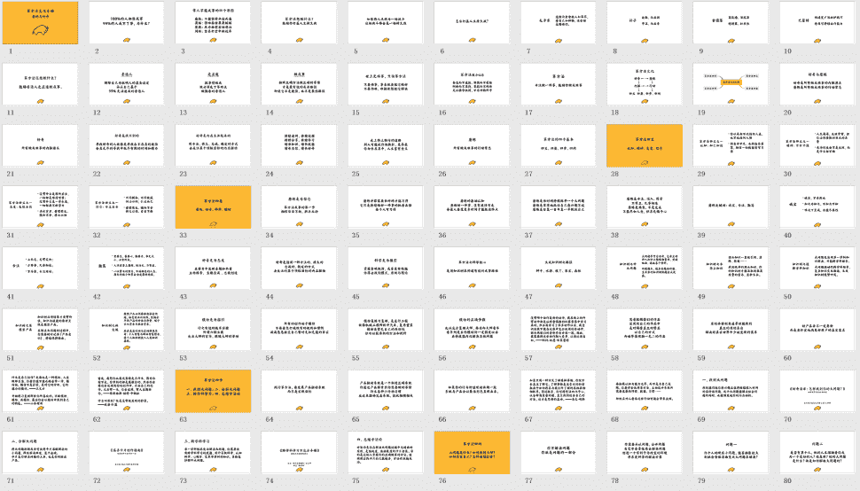

# 《笨方法文化手册 3.0》下载地址

> 来源：[`www.yuque.com/hardwaylab/book/miyg7a`](https://www.yuque.com/hardwaylab/book/miyg7a)

<ne-oli><ne-oli-i>1</ne-oli-i><ne-oli-c class="ne-oli-content" id="u47b5f0c2" data-lake-id="u47b5f0c2">Github 下载：[点击此处](https://github.com/cnfeat/hardwaylab)</ne-oli-c></ne-oli> <ne-oli><ne-oli-i>2</ne-oli-i><ne-oli-c class="ne-oli-content" id="u0f5898d9" data-lake-id="u0f5898d9">微信下载：扫描添加微信，发送「文化手册」</ne-oli-c></ne-oli> 

添加微信，再附赠 100 页《笨方法文化幻灯：好奇与磨练》 

<ne-card data-card-name="image" data-card-type="inline" id="u2f0aa425" data-event-boundary="card" class="ne-spacing-all"><ne-card data-card-name="image" data-card-type="inline" id="u153cd7a8" data-event-boundary="card" class="ne-spacing-all">笨方法文化手册 3.0 版本世上无难事,只怕笨方法笨方法实验室 WWW.HARDWAYLAB.COM  <ne-p id="uc4147bbc" data-lake-id="uc4147bbc"><ne-card data-card-name="image" data-card-type="inline" id="u55558eae" data-event-boundary="card" class="ne-spacing-all">华浩特坊 1R*曲 a 乐 ACMME:702395tee2818208 张 1112131714191615184 者上民系轩自小肉区址本量 4E1:9 特流 TERU1R08HWI21252326272830222988-1524054955220 代 5541AIAA323736J8353539+北 4.M00 机:纯省市山电心 98A8874 号 TRACA258AI194G1744813455012aW 城农+O#E9 内再物州州连精售部 51 店 1 欢大 s 士业快!园套特专汽中西国国牌电中国司司长线牌 27022021088000%50a63b1b9b625655 一内国意迎 1I7A03892FWFER:箱 A,1c3GRG46765G6266E9 阿献发惠相 mAHEF6 带 8 庆 P 安 671747279737576  <ne-p id="uf40bc8b4" data-lake-id="uf40bc8b4">gayhub 链接，404 Not Found 了，大佬 

已更新。 

感谢！ 

github 404 了 

已更新。</ne-card></ne-p></ne-card></ne-card></ne-p>