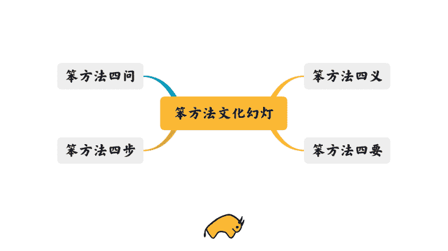
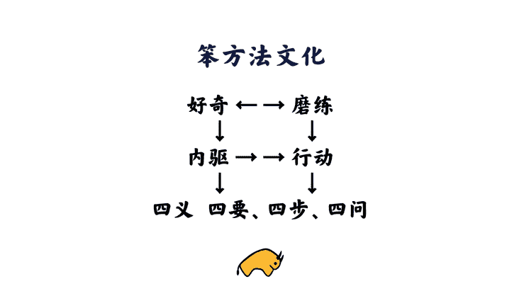

# 怎样掌握笨方法？

> 来源：[`www.yuque.com/hardwaylab/book/fu1wbk`](https://www.yuque.com/hardwaylab/book/fu1wbk)

<ne-quote id="ueed687f5" data-lake-id="ueed687f5"><ne-p id="u81a73dfe" data-lake-id="u81a73dfe"><ne-text id="u0cbf2cd4">尊重基本事实的前提下，各式各样的偏见并存，远远好过唯一的正确答案。——《司马迁的记忆之野》</ne-text></ne-p></ne-quote> <ne-p id="984eefb133288f41cdddcc8df706dbe3" data-lake-id="984eefb133288f41cdddcc8df706dbe3"><ne-text id="ufb491443">笨方法，不教你弯道超车，只教你少走弯路。不教你快的技巧，只教你专注的功夫。</ne-text></ne-p> <ne-p id="ubacc8bf9" data-lake-id="ubacc8bf9"><ne-card data-card-name="image" data-card-type="inline" id="u9112b64f" data-event-boundary="card" class="ne-spacing-all">  <ne-p id="79b003dcfa263fd3a8d5c0ad7c9d7177" data-lake-id="79b003dcfa263fd3a8d5c0ad7c9d7177"><ne-text id="ua44e5921" ne-bold="true">四义：</ne-text><ne-text id="ua8d24d9a">是要接受自己是普通人，而不是聪明人。</ne-text></ne-p> <ne-p id="9ea8357c1de7281b7059286f5b645222" data-lake-id="9ea8357c1de7281b7059286f5b645222"><ne-text id="ud2b13a3b" ne-bold="true">四要：</ne-text><ne-text id="u14864e6d">是要去做，而不是什么都不做。</ne-text></ne-p> <ne-p id="u05d7ce50" data-lake-id="u05d7ce50"><ne-text id="ub82d47ba">践行「磨练、好奇、科学、模仿」。</ne-text></ne-p> <ne-uli><ne-uli-i>●</ne-uli-i><ne-uli-c class="ne-uli-content" id="u24738020" data-lake-id="u24738020"><ne-text id="ufd9173c0">磨练：是为故事，自我决定驱动探索</ne-text></ne-uli-c></ne-uli> <ne-uli><ne-uli-i>●</ne-uli-i><ne-uli-c class="ne-uli-content" id="ue6cd0c73" data-lake-id="ue6cd0c73"><ne-text id="u9bee3e68">好奇：是为信念，建立全局认知地图</ne-text></ne-uli-c></ne-uli> <ne-uli><ne-uli-i>●</ne-uli-i><ne-uli-c class="ne-uli-content" id="ub2d14a2a" data-lake-id="ub2d14a2a"><ne-text id="u2ea628ee">科学：是为模型，学习最小必要知识</ne-text></ne-uli-c></ne-uli> <ne-uli><ne-uli-i>●</ne-uli-i><ne-uli-c class="ne-uli-content" id="u2e1c9fbe" data-lake-id="u2e1c9fbe"><ne-text id="u57149b4b">模仿：是为行动，复刻创造最佳实践</ne-text></ne-uli-c></ne-uli> <ne-p id="cdd9e8eda237d298d5aa3607c56a685e" data-lake-id="cdd9e8eda237d298d5aa3607c56a685e"><ne-text id="u2bbbe1d9" ne-bold="true" ne-fontsize="14" style="color: rgb(42, 49, 53);">四步：</ne-text><ne-text id="u74b8a74a">是要发展系统，而</ne-text><ne-text id="ua7140e79" style="color: rgb(42, 49, 53);">不是实现目标。</ne-text></ne-p> <ne-p id="f2630a1ff46ef1a7eb1cb380b49dbf67" data-lake-id="f2630a1ff46ef1a7eb1cb380b49dbf67"><ne-text id="u70f876c4" ne-bold="true" style="color: rgb(42, 49, 53);">四问：</ne-text><ne-text id="ua219c82a">是要探索可能的自我，而不是寻找真正的自我。</ne-text></ne-p> <ne-p id="u93e88959" data-lake-id="u93e88959"><ne-card data-card-name="image" data-card-type="inline" id="ub04699d2" data-event-boundary="card" class="ne-spacing-all">  <ne-h2 id="NL2xa" data-lake-id="NL2xa"><ne-heading-ext><ne-heading-anchor></ne-heading-anchor><ne-heading-fold></ne-heading-fold></ne-heading-ext> <ne-heading-content></ne-heading-content></ne-h2></ne-card></ne-p></ne-card></ne-p>