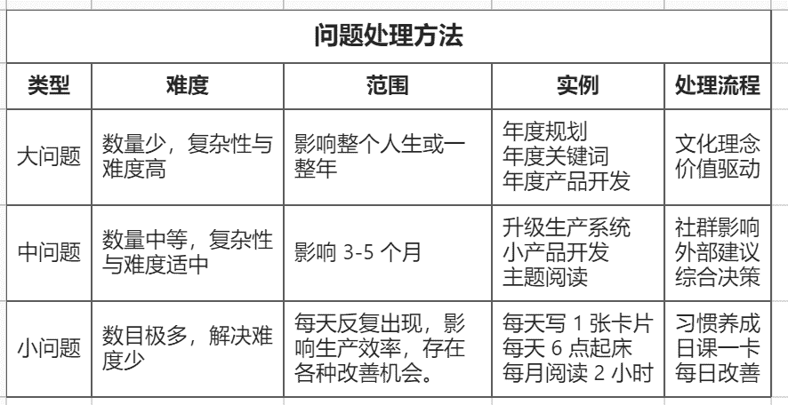

# 四问：怎样走上笨方法道路？

> 来源：[`www.yuque.com/hardwaylab/book/dvlfog`](https://www.yuque.com/hardwaylab/book/dvlfog)

<ne-quote id="u2cd79b79" data-lake-id="u2cd79b79"><ne-p id="u3df3d121" data-lake-id="u3df3d121"><ne-text id="u4d19b9c9">不是因为我太聪明，而是因为我在问题上停留的时间更长。——阿尔伯特 · 爱因斯坦</ne-text></ne-p></ne-quote> <ne-p id="uf48687ef" data-lake-id="uf48687ef"><ne-text id="u0e468cf6">段永平：不存在什么捷径。不存在什么窍门。如果你想走轻松的路，我保证：它比艰难的路更长更痛苦。</ne-text></ne-p> <ne-p id="u5dd233ca" data-lake-id="u5dd233ca"><ne-text id="ue4fdcce2">Alaska 有句话，shortcut is the fastest way to get lost（捷径是迷路的最快的办法。）不存在什么弯道超车的事情，关注本质最重要！不然即使超过去，也会被超回来。（2018-09-30）</ne-text></ne-p> <ne-p id="u70e427ce" data-lake-id="u70e427ce"><ne-text id="u1742c32a">如果你不承认自己有问题，你不会改变，如果你不相信你有问题，你也不会改变。</ne-text></ne-p> <ne-p id="uca472452" data-lake-id="uca472452"><ne-text id="ud89e49e2">面对一个可能影响到我们所有人的事件时，倘若还没有人发现问题和指出问题，那我们就应该站出来，发现和指出问题所在。而当所有人都已经瞄准了这个问题，甚至已经形成情绪时，我们或许不应任由情绪继续泛滥，而是更应该思考和引导大家思考：到底如何才能更好解决问题？</ne-text></ne-p> <ne-p id="uaae84422" data-lake-id="uaae84422"><ne-text id="uded2d800">毕竟，</ne-text><ne-text id="u2a383ff7">如果你不解决问题，那么你就是问题的一部分。</ne-text></ne-p> <ne-p id="udd3e7c5f" data-lake-id="udd3e7c5f"><ne-text id="u2e8799b1">你必须建立一个元问题库，里面都是你最喜欢的问题，当你透过你最喜欢的问题的镜头看世界时，大脑会暗自运行组织思维，在生活中找到线索。这种新的意识将帮助你建立信心和信任，保持你对人生的好奇探求。</ne-text></ne-p> <ne-p id="ucaa014b8" data-lake-id="ucaa014b8"><ne-text id="ue0d8505d">你需要承认问题，并公开问题，寻找信息与帮助，自觉带着责任感去解决问题，创造一个有利于你改变的环境，寻求更科学的解决方案。</ne-text></ne-p> <ne-uli><ne-uli-i>●</ne-uli-i><ne-uli-c class="ne-uli-content" id="ucb75433b" data-lake-id="ucb75433b"><ne-text id="u7d177b47">1）确定大问题；</ne-text></ne-uli-c></ne-uli> <ne-uli><ne-uli-i>●</ne-uli-i><ne-uli-c class="ne-uli-content" id="u708c9007" data-lake-id="u708c9007"><ne-text id="ub0694226">2）找到大问题的各种成因；</ne-text></ne-uli-c></ne-uli> <ne-uli><ne-uli-i>●</ne-uli-i><ne-uli-c class="ne-uli-content" id="ub6a9dc5a" data-lake-id="ub6a9dc5a"><ne-text id="u6d431f21">3）确定大问题的解决后理想结果；</ne-text></ne-uli-c></ne-uli> <ne-uli><ne-uli-i>●</ne-uli-i><ne-uli-c class="ne-uli-content" id="u274598c0" data-lake-id="u274598c0"><ne-text id="u70ad7673">4）根据以上因果关系，拆分出各种小问题；</ne-text></ne-uli-c></ne-uli> <ne-uli><ne-uli-i>●</ne-uli-i><ne-uli-c class="ne-uli-content" id="u0ed7c07d" data-lake-id="u0ed7c07d"><ne-text id="udf3feff1">5）反复审查问题因果，查漏补缺，完善问题分支。</ne-text></ne-uli-c></ne-uli> <ne-p id="u3a7aff11" data-lake-id="u3a7aff11"><ne-text id="ua0c86952">拆解完大问题后，你会发现，各种小问题根本无法用单一维度，单一学科知识解决，只能才多维度，多学科解决。</ne-text></ne-p> <ne-p id="u525813c8" data-lake-id="u525813c8"><ne-text id="ud87abf9f">拆解大问题时要注意，没有人一开始就能拆解出好的小问题，一旦发现一个小问题再无法指导你的努力方向，就要及时放弃和替换。当某个小问题比另外一个更有效率、更有趣，或者比你原先的计划更合理时，你不妨做出改变。各个小问题要注意层次越统一、一致协调，这样就有助于解答大问题。</ne-text></ne-p> <ne-p id="a20d224c568e48b9d67847a2c66a8c01_p_0" data-lake-id="a20d224c568e48b9d67847a2c66a8c01_p_0"><ne-text id="u703214d1">好问题比答案重要，以下 4 个笨方法元问题，值得持续一生去追寻。</ne-text></ne-p> <ne-oli><ne-oli-i>1</ne-oli-i><ne-oli-c class="ne-oli-content" id="f7de0d8fb9dbd0e675de94be7b2d7e1e" data-lake-id="f7de0d8fb9dbd0e675de94be7b2d7e1e"><ne-text id="uc82c63b1">你的个人现实小问题，能否抽象放大到社会责任层面，变成一个大问题，你将推动解决这个问题？</ne-text></ne-oli-c></ne-oli> <ne-oli><ne-oli-i>2</ne-oli-i><ne-oli-c class="ne-oli-content" id="7a05f66d41c8ed74948715b39ffe1012" data-lake-id="7a05f66d41c8ed74948715b39ffe1012"><ne-text id="u531b1272">是否有某个人，他的人生激励着你成为一个更好的人？他是谁？他的大问题是什么？他是如何解决大问题的？</ne-text></ne-oli-c></ne-oli> <ne-oli><ne-oli-i>3</ne-oli-i><ne-oli-c class="ne-oli-content" id="4e530aee7ba3854d1b5ff71008f6a4b5" data-lake-id="4e530aee7ba3854d1b5ff71008f6a4b5"><ne-text id="u647b2d83">如何怎样采取微小但有意义的方式，可以不假思索地、惯性地持续行动实践，并改变当前的工作态度或生活方式？</ne-text></ne-oli-c></ne-oli> <ne-oli><ne-oli-i>4</ne-oli-i><ne-oli-c class="ne-oli-content" id="94a5dbb1fea79f67c2d4b52593191f2e" data-lake-id="94a5dbb1fea79f67c2d4b52593191f2e"><ne-text id="u3d92c271">如何将你探寻、分解、解决大问题的过程孵化成为个人项目，并将项目成果封装成为能为解决社会问题的产品或服务？</ne-text></ne-oli-c></ne-oli> <ne-p id="u623818fe" data-lake-id="u623818fe"><ne-card data-card-name="image" data-card-type="inline" id="ua05b2641" data-event-boundary="card" class="ne-spacing-all">  <ne-hole id="u61f64417" data-lake-id="u61f64417"><ne-card data-card-name="hr" data-card-type="block" id="wrGKo" data-event-boundary="card"><ne-p id="u8535be57" data-lake-id="u8535be57"><ne-text id="u9177839f">分享一个持续自我提问的小技巧：</ne-text></ne-p> <ne-p id="u5e6a7eb8" data-lake-id="u5e6a7eb8"><ne-text id="ueb46d57f">注册一个</ne-text> [<ne-text id="ub16bdb73">flomo</ne-text>](https://flomoapp.com/register2/?NDA0MA) <ne-text id="u058b6978">账号，建立一个「面试题库」的标签，每条 flomo 就是一个问题，使用</ne-text>[<ne-text id="u16f543ec">「每日回顾」</ne-text>](https://help.flomoapp.com/advance/lucky.html)<ne-text id="u772da080">功能，每天早上 10 点和晚上 10 点定时给自己发送问题。</ne-text></ne-p> <ne-p id="uc938dd17" data-lake-id="uc938dd17"><ne-text id="uf239d516">「面试题库」的问题清单见</ne-text> [<ne-text id="u4d73b4b9">笨方法实验室会员计划</ne-text>](https://www.yuque.com/hardwaylab/book/bq5a1v)<ne-text id="u0cf52fbd">。</ne-text></ne-p></ne-card></ne-hole></ne-card></ne-p>