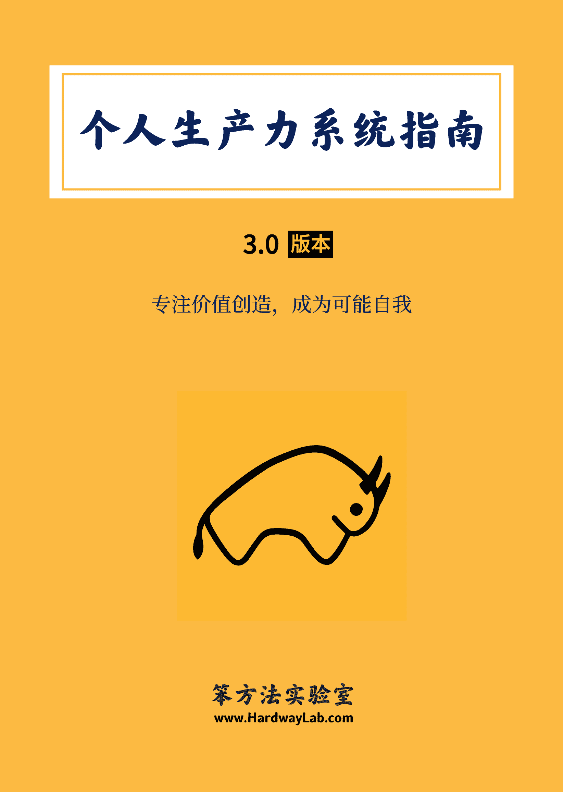

# 个人生产力系统指南：成为可能自我

> 来源：[`www.yuque.com/hardwaylab/book/gizm18`](https://www.yuque.com/hardwaylab/book/gizm18)

<ne-h2 id="jse0x" data-lake-id="jse0x"><ne-heading-ext><ne-heading-anchor></ne-heading-anchor><ne-heading-fold></ne-heading-fold></ne-heading-ext><ne-heading-content><ne-card data-card-name="image" data-card-type="inline" id="u3a77509d" data-event-boundary="card" class="ne-spacing-all">个人生产力系统指南 3.0 版本专注价值创造,成为可能自我笨方法实验室 WWW.HARDWAYLAB.COM  <ne-h2 id="e5DfW" data-lake-id="e5DfW"><ne-heading-ext><ne-heading-anchor></ne-heading-anchor><ne-heading-fold></ne-heading-fold></ne-heading-ext><ne-heading-content><ne-text id="uce9a4b5c">1</ne-text></ne-heading-content></ne-h2> <ne-p id="ud3b3a785" data-lake-id="ud3b3a785"><ne-text id="u73381ab0">多数人并没有正确理解生产力。</ne-text></ne-p> <ne-p id="u656ce670" data-lake-id="u656ce670"><ne-text id="u6d2eb919">市面多见的生产力指南，第一是效率工具的使用，第二是时间管理的方法。</ne-text></ne-p> <ne-p id="u81b99b6e" data-lake-id="u81b99b6e"><ne-text id="u83ffc767" ne-bold="true">生产力不是某个工具的功能介绍和使用技巧。</ne-text></ne-p> <ne-p id="udc02dec5" data-lake-id="udc02dec5"><ne-text id="u8fe2bcda">许多创作者跟随这些工具指引去行动，以「工具」作为入口去提升生产力，这种方法虽然轻松简单，但会被工具主义与技术主义带错方向，导致在微观上更关注某个功能操作细节，而忘记使用这个工具的初衷与使命。</ne-text></ne-p> <ne-p id="ueb111b2e" data-lake-id="ueb111b2e"><ne-text id="ub5677111" ne-bold="true">生产力也不是更快更好地在待办事项清单上打勾。</ne-text></ne-p> <ne-p id="u002c1976" data-lake-id="u002c1976"><ne-text id="u683cba02">时间管理被包装成消灭忙碌的良药，列一堆任务清单，试图最大化地利用有限时间，制造一种控制一切的错觉，但事实是，时间管理本身制造出了另一种形式的忙碌，以忙碌覆盖忙碌。</ne-text></ne-p> <ne-p id="u86b03b56" data-lake-id="u86b03b56"><ne-text id="uf4a9583d">更加荒谬的是，你去做时间管理，并不是真的想去管理时间，而只是用正确的方式做成正确的事情，在你没有搞懂什么是正确的方式，什么是正确的事情之前，你时间管理得再好，但每分每秒都在原地打转，没有丝毫进步，你的付出就没有意义。</ne-text></ne-p> <ne-h2 id="Ir3y2" data-lake-id="Ir3y2"><ne-heading-ext><ne-heading-anchor></ne-heading-anchor><ne-heading-fold></ne-heading-fold></ne-heading-ext><ne-heading-content><ne-text id="u27782d1d">2</ne-text></ne-heading-content></ne-h2> <ne-p id="uded3a63f" data-lake-id="uded3a63f"><ne-text id="u055b47a5">什么才是生产力？</ne-text></ne-p> <ne-p id="uf03df670" data-lake-id="uf03df670"><ne-text id="ub0c9a7a3">生产力，不单单局限在工具与工作领域，你不必时时追求更先进的笔记技术和工具，也不必经常保持自己处在忙碌状态。</ne-text></ne-p> <ne-p id="u637b42e0" data-lake-id="u637b42e0"><ne-text id="ub6970fad">它是一套系统，它基于你对产品服务与自我身份的理解，然后针对你所拥有的时间、技能、智力、精力、资源和机会，进行深思熟虑的战略性投资与运作。</ne-text></ne-p> <ne-p id="ua4a8644d" data-lake-id="ua4a8644d"><ne-text id="u4acda88e">它是一套指导方法，是价值理念、思考方式、生产方式与生产工具的知行合一，确保你在用正确的方式做成正确的事情。一旦你真的做到用正确的方式做成正确的事情，就无需时间管理。</ne-text></ne-p> <ne-p id="u2a005f08" data-lake-id="u2a005f08"><ne-text id="ud90e2149">这套系统关注以人为本的效率提升，关注人生信念的持续实现，贯穿你的整个人生，实现并维护以下两种人生状态：</ne-text></ne-p> <ne-p id="u9c8c63ae" data-lake-id="u9c8c63ae"><ne-text id="u924e1d45" ne-bold="true">一、当下身心富足，未来健康从容</ne-text></ne-p> <ne-p id="ub0ed9c23" data-lake-id="ub0ed9c23"><ne-text id="u27c5d70a">生产力是生活幸福感、创造心流、优秀工作习惯与趁手工具的结合，从而抵达身心富足的一种状态。</ne-text></ne-p> <ne-p id="ue490107f" data-lake-id="ue490107f"><ne-text id="ue64a6945">它包括且不限于以下关键词：良好睡眠、饮食运动、坚定拒绝、专注简洁等。</ne-text></ne-p> <ne-p id="uf160ff74" data-lake-id="uf160ff74"><ne-text id="u5fa9e6fe" ne-bold="true">二、专注价值创造，成为可能自我</ne-text></ne-p> <ne-p id="u86340b41" data-lake-id="u86340b41"><ne-text id="u4e5b3996">生产力是勇于面对不确定，建立自我安全感，达成自我契约，专注价值创造，成为可能自我的过程。</ne-text></ne-p> <ne-p id="ua188eeba" data-lake-id="ua188eeba"><ne-text id="u01cfa6c6">它包括且不限于以下关键词：终身学习、超越技能，自主优化、工作分发、自动化操作、效率工具等。</ne-text></ne-p> <ne-h2 id="i26gQ" data-lake-id="i26gQ"><ne-heading-ext><ne-heading-anchor></ne-heading-anchor><ne-heading-fold></ne-heading-fold></ne-heading-ext><ne-heading-content><ne-text id="u8787ecc9">3</ne-text></ne-heading-content></ne-h2> <ne-p id="u01cd4b17" data-lake-id="u01cd4b17"><ne-text id="u8cb8d589">好的生产力系统，不是只想把先进工具和高效工作方法告诉你，它像指南针，避免你被各种层出不穷的生产力工具带着走；它像是河流，能自动驱动你去寻找最优生产方法来优化工具组合；它像是火焰，赋予创作者的热情，点燃工具组合的最大价值。</ne-text></ne-p> <ne-p id="u948e4380" data-lake-id="u948e4380"><ne-text id="u63740427">经过 8+ 年的实践，我总结了一套个人生产力系统，我用这套系统写出了《笨方法文化手册》、《笨方法学写作》和《发展写作学》，这套系统可产生价值，长期复用，以帮助你实现你的宏大构想，打造个人品牌，开发产品，打造社区，创造文化等。</ne-text></ne-p> <ne-p id="ud842d871" data-lake-id="ud842d871"><ne-text id="u8b9d9884">这套系统由产品系统、身份系统、生产系统组合而成， 即个人生产力三角形理论。</ne-text></ne-p> <ne-p id="ubac23893" data-lake-id="ubac23893"><ne-text id="u6ef5f5c8">它能促使你主动思考、学习、成长、持续改善，通过达成无数小进步，探索到更好的人生问题解决办法，让你宏观有耐心，微观有效率，成为可能自我。</ne-text></ne-p>  <ne-p id="u8d0a852d" data-lake-id="u8d0a852d" ne-alignment="left"><ne-card data-card-name="image" data-card-type="inline" id="MIS14" data-event-boundary="card" class="ne-spacing-all"><ne-p id="uf8e60248" data-lake-id="uf8e60248"><ne-text id="u2660f680">你可以在本指南中收获：</ne-text></ne-p> <ne-h2 id="Jzf5A" data-lake-id="Jzf5A"><ne-heading-ext><ne-heading-anchor></ne-heading-anchor><ne-heading-fold></ne-heading-fold></ne-heading-ext><ne-heading-content><ne-text id="u5138bf19">内容大纲</ne-text></ne-heading-content></ne-h2> <ne-p id="u38594c5c" data-lake-id="u38594c5c"><ne-text id="ubc2cb327">本书综合我实践优化生产力的所有经验，全书分为 3 部分，共 9 万+ 字，220+ 页。</ne-text></ne-p>  <ne-p id="ub6a15701" data-lake-id="ub6a15701" ne-alignment="left"><ne-card data-card-name="image" data-card-type="inline" id="z9WBY" data-event-boundary="card" class="ne-spacing-all"><ne-h2 id="Yi8Xs" data-lake-id="Yi8Xs"><ne-heading-ext><ne-heading-anchor></ne-heading-anchor><ne-heading-fold></ne-heading-fold></ne-heading-ext><ne-heading-content><ne-text id="u310febf3">2\. 社群服务</ne-text></ne-heading-content></ne-h2> <ne-p id="u7ebe04aa" data-lake-id="u7ebe04aa"><ne-text id="u59614ee4">一经购买，永久更新，并加入本手册讨论社群，购买后请添加文末微信出示订单截图即可。</ne-text></ne-p>  <ne-p id="uc81b76fe" data-lake-id="uc81b76fe"><ne-card data-card-name="image" data-card-type="inline" id="uc80eac4e" data-event-boundary="card" class="ne-spacing-all"><ne-h2 id="tX7k5" data-lake-id="tX7k5" ne-alignment="left"><ne-heading-ext><ne-heading-anchor></ne-heading-anchor><ne-heading-fold></ne-heading-fold></ne-heading-ext><ne-heading-content><ne-text id="u0f204513" style="color: rgb(41, 37, 37);">购买须知</ne-text></ne-heading-content></ne-h2> <ne-uli><ne-uli-i>●</ne-uli-i><ne-uli-c class="ne-uli-content" id="u28ccb3af" data-lake-id="u28ccb3af"><ne-text id="u1a3879da">购买地址：</ne-text>[<ne-text id="u0e1fef5d">https://cie.h5.xeknow.com/s/2iNUXb</ne-text>](https://cie.h5.xeknow.com/s/2iNUXb)</ne-uli-c></ne-uli> <ne-uli><ne-uli-i>●</ne-uli-i><ne-uli-c class="ne-uli-content" id="ued624c89" data-lake-id="ued624c89"><ne-text id="u39c8d927">本指南为虚拟内容服务，一经购买成功概不退款，请您理解。</ne-text></ne-uli-c></ne-uli> <ne-uli><ne-uli-i>●</ne-uli-i><ne-uli-c class="ne-uli-content" id="ub6a255f8" data-lake-id="ub6a255f8"><ne-text id="uc6298a05">如果你还没有购买过笨方法实验室相关课程，建议先搜索阅读</ne-text>[<ne-text id="u79951e01">《笨方法文化手册》</ne-text>](https://www.yuque.com/hardwaylab/book)<ne-text id="uf650e8d1">再做决定。</ne-text></ne-uli-c></ne-uli> <ne-uli><ne-uli-i>●</ne-uli-i><ne-uli-c class="ne-uli-content" id="u84a7d18d" data-lake-id="u84a7d18d"><ne-text id="u2b3e2e94">本指南也是</ne-text>[<ne-text id="ub15ed6e5">笨方法实验室会员计划</ne-text>](https://www.yuque.com/hardwaylab/book/bq5a1v)<ne-text id="u93f5cf2a">的权益内容，订阅读者将免费获得该电子书。</ne-text></ne-uli-c></ne-uli> <ne-uli><ne-uli-i>●</ne-uli-i><ne-uli-c class="ne-uli-content" id="uef5dc0a1" data-lake-id="uef5dc0a1"><ne-text id="u0d7b9cf2">本指南不定期更新小版本，每年至少更新一次大版本。</ne-text></ne-uli-c></ne-uli> <ne-uli><ne-uli-i>●</ne-uli-i><ne-uli-c class="ne-uli-content" id="ua014954e" data-lake-id="ua014954e"><ne-text id="u501a6164">已购买用户，可查看过往订单下载最新版，申请加入社群。</ne-text></ne-uli-c></ne-uli> <ne-uli ne-alignment="left"><ne-uli-i>●</ne-uli-i><ne-uli-c class="ne-uli-content" id="u281a467e" data-lake-id="u281a467e"><ne-text id="uf2863dc5">如遇到任何问题，可以添加微信寻求帮助，我会尽快回复。∎</ne-text></ne-uli-c></ne-uli> <ne-h3 id="eZnCj" data-lake-id="eZnCj"><ne-heading-ext><ne-heading-anchor></ne-heading-anchor><ne-heading-fold></ne-heading-fold></ne-heading-ext><ne-heading-content><ne-card data-card-name="image" data-card-type="inline" id="oXpXm" data-event-boundary="card" class="ne-spacing-all"></ne-card></ne-heading-content></ne-h3></ne-card></ne-p></ne-card></ne-p></ne-card></ne-p></ne-card></ne-heading-content></ne-h2>