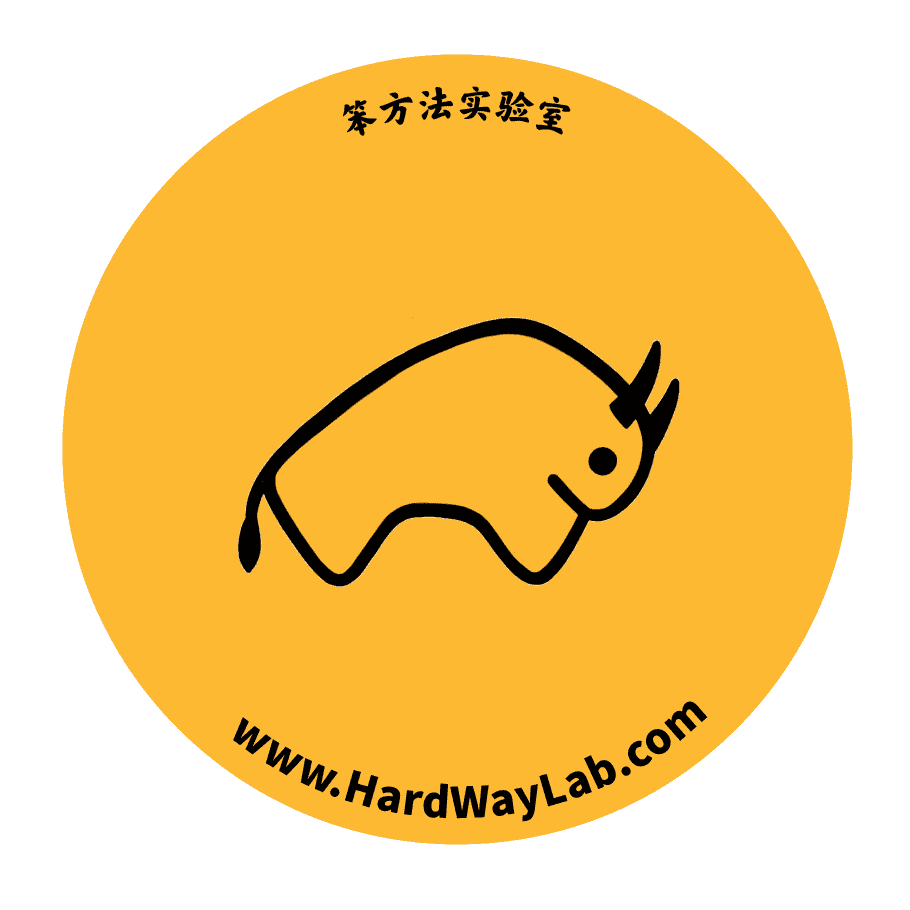
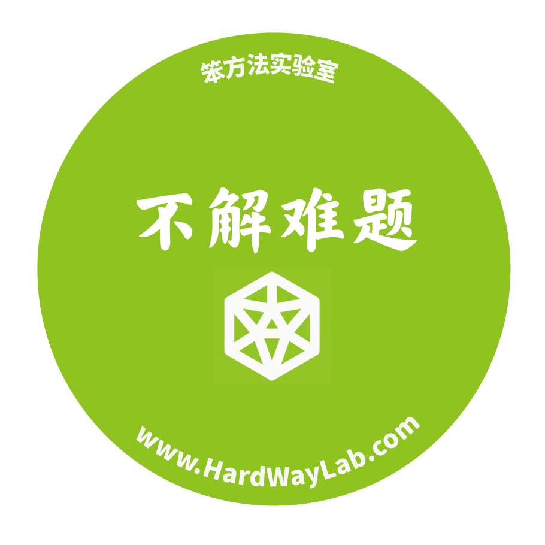
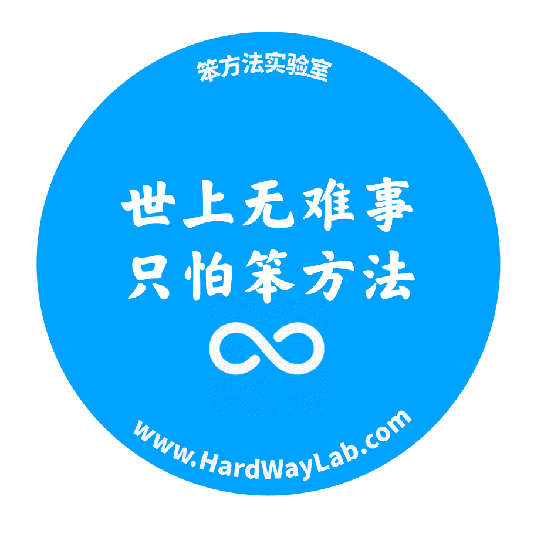
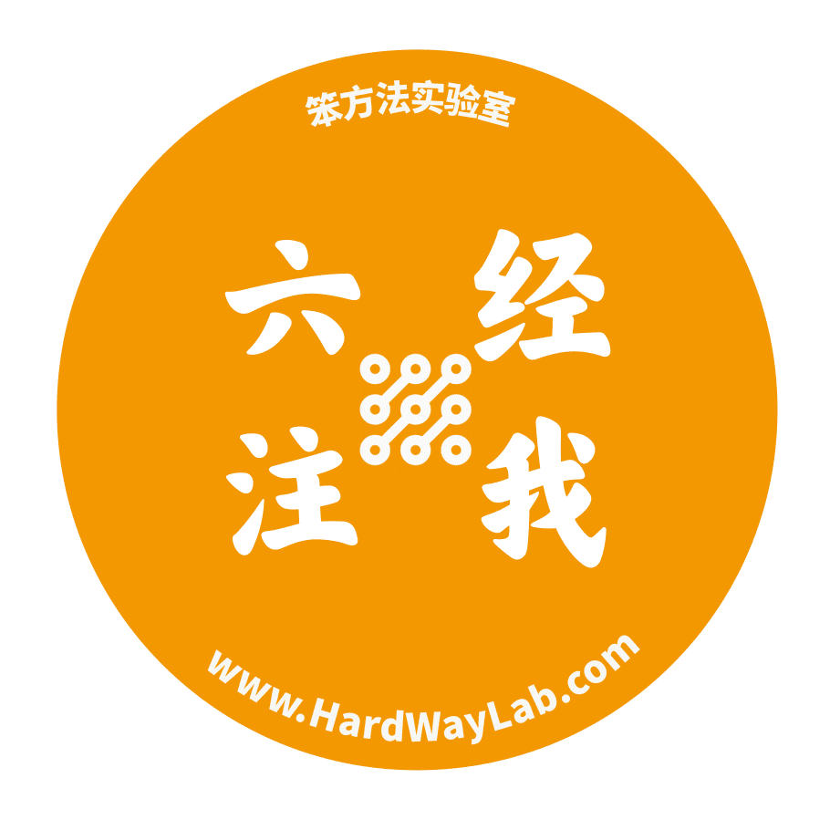
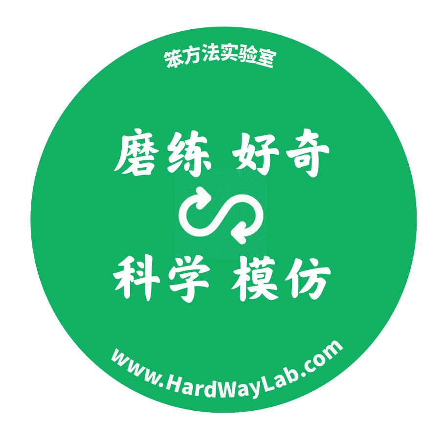

# 附：设计周边

> 来源：[`www.yuque.com/hardwaylab/book/tvf22k`](https://www.yuque.com/hardwaylab/book/tvf22k)

### 品牌形象：黄牛

 

简单、勤奋、爱阅读、爱写作、爱分享、让生活变得充实、困难迎面而上、坚定不移、不屈不挠、对自己能力信心满满、接受平凡、不甘于平凡、谦虚低调好奇心、如饥似渴地学习知识…… 

### 他会说

 

不得贪胜、知识就是力量、跨学科学习、实事求是 

### 最重要的品质

 

乐观、诚实、内在驱动、探索、独立、挑战、坚毅、耐心、自律 

### 鄙视

 

虚伪、停滞、界限、放弃、一成不变、维持现状、苦苦等待、自满、算计 

### 对立面

 

消极、偏见、欺骗、逃避、放弃、傲慢、肤浅 

### 代表人物

 

巴菲特、芒格、Ray Dalio、司马贺、海明威、李昌镐、村上春树、李叔同、钱钟书、曾国藩、顾准、王阳明 

### 品牌特点

 

理性、创意、自由、开放、简单生活、鼓励探索发现、注重质量而不是外形和风格 ∎ 

紫方法实验室 LNNUSOWOUNDR.EDA

紫方法实验不解难题?I 信 BAWTNWG

笨方法实验室世上无难事只怕笨方法 CO:IwASOSOOONNDED

米方法实验六经露我注:QMYSSONOOUSRHED

麻方法实验堂磨练好奇科学模仿?AMRRWNNWDLnyD

